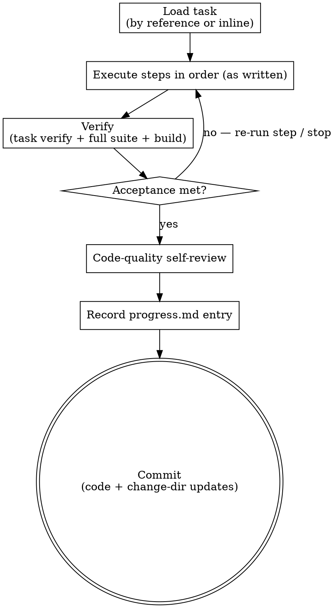

# Implementing a task

Implement exactly one planned task by carrying out its steps as written, then self-review
the result for quality before committing.

The **pipeline** is Hamilton's spec-driven sequence for a change: propose → plan → code →
review → finish-work. Each step is a skill a person or an agent can run. This skill is the
**code** step.

**Scope: one task, steps as written.** The task's Steps were already designed and ordered
by the plan step. Your job is to execute them faithfully — not to redesign, reorder, or
add work. All the planning thinking happened upstream; keep your own to a minimum.

## Inputs

Exactly one of these two forms identifies the task — never both:

- **By reference:** the change's `plan.md` plus the id of the task (e.g. "Task 3").
- **Inline:** the task block itself, as text or JSON, with its Files, Acceptance, Steps,
  Verify, and Commit.

Plus:

- The change directory path (`.hamilton/changes/<change>/`) — always present; where cited
  `design.md` / `requirements/` live and where `progress.md` is appended.
- If the task cites `design.md` / `requirements/` sections and they are available, read them
  for the acceptance criteria. Reference them; do not re-derive them.
- Project standards (`AGENTS.md`): test/build commands, code style, git workflow, boundaries.
- Optional: review feedback from a prior pass on this task — address it within this task.

## Principles

- **Follow the steps exactly.** The Steps are authoritative and already ordered. Execute
  them in order, as written. If a step looks wrong or is impossible, stop and report it —
  do not improvise a fix.
- **Follow the grain.** Match the project's existing patterns, naming, and structure.
- **Small and honest.** No stubs, TODOs, dead code, or commented-out blocks. If a step
  cannot be completed, stop and report — do not fake it.
- **Stay in bounds.** Respect the three-tier boundaries below.

## Process

1. **Load the task** from whichever input form was given. Read its Acceptance, any cited
   design/requirements sections, and the project standards. Do not look at other tasks.
2. **Execute the steps in order,** exactly as written, running the tests and commands each
   step specifies.
3. **Verify.** Run the task's Verify command, then the full test suite and the
   build/typecheck. All must pass.
4. **Check acceptance.** Confirm each acceptance criterion is met. List any that are not and
   resolve them by re-running the relevant step — or stop and report if blocked.
5. **Code-quality self-review.** Check your diff against the checklist below; fix what you
   find.
6. **Record progress.** Append an entry to the change directory's `progress.md` (format
   below).
7. **Commit** using the task's Commit message and the project's git workflow. The commit must
   include the change-directory updates — `progress.md` and any other artifact under
   `.hamilton/changes/<change>/` you touched — alongside the code. Leave nothing in the change
   directory uncommitted before you finish; run `git status` to confirm the tree is clean.

This skill never edits `plan.md`.

## Progress entry

Append to `.hamilton/changes/<change>/progress.md`, following the
`~/.hamilton/templates/progress.md` format:

```
## <Task id>: <title> — <YYYY-MM-DD>
- Outcome: done | blocked
- Changed: created <…>, modified <…>, deleted <…>
- Verified: `<command>` → <result>
- Notes: <deviations, decisions, anything to flag for review>
```

## Boundaries

- Always: run tests before committing; follow the project's conventions.
- Ask first: any decision the task did not specify (changing a public interface, adding a
  dependency, anything the design marks ask-first). Working with a person, ask. Running
  unattended, do not improvise a large decision — record it in progress and, if it blocks
  a step, stop.
- Never: commit secrets; delete or weaken a test to make the suite pass; touch anything the
  design marks off-limits; implement a task other than the one assigned.

## Code-quality self-review

- Do the tests assert real behavior (not implementation trivia), and would they fail if the
  code broke?
- Is the change confined to this task — no scope creep?
- Are naming, structure, and error handling consistent with the codebase?
- No dead code, stubs, leftover debug output, or commented-out blocks?
- Is every acceptance criterion satisfied?

## Output

Implemented production code and tests for the one task; the full suite and build passing; and
a commit following the project's git workflow that includes both the code and the change-dir
updates (the `progress.md` entry and any other change-dir artifact touched), with nothing left
uncommitted under `.hamilton/changes/<change>/`. This skill does not modify `plan.md`. If
anything is unresolved, state it plainly.

## Process flow


