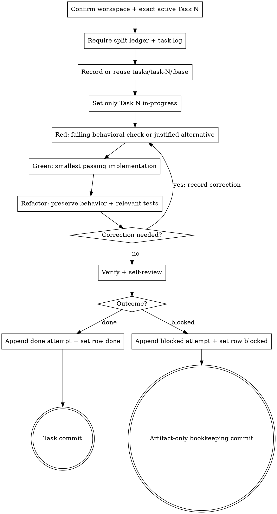

# Implementing one task

Implement exactly one active plan task, carry out its steps as written, verify the result,
self-review it, and commit the implementation with synchronized task-local evidence.

The **seven-stage core pipeline** is Hamilton's fixed spec-driven sequence: init → propose → plan → code →
code-feedback → review → finish-work. Each step is a skill a person or an agent can run. This
skill is **step 3**, the code step. Wayfinder and `hamilton-critique` are optional and remain
outside the seven-step core count.

**Scope: one task, steps as written.** The task's Steps were already designed and ordered by
the plan step. Execute them faithfully. Do not redesign, reorder, add work, or inspect sibling
task evidence.

## Inputs

Every invocation identifies exactly one existing active `Task N` from the change's `plan.md`.
Exactly one of these forms supplies it:

- **By reference:** the change's `plan.md` plus the exact numeric task id, such as `Task 3`.
- **Inline:** one task block that includes its exact numeric `Task N` id as well as Files,
  Acceptance, Steps, Verify, and Commit. If an inline task omits the numeric task id, includes
  more than one id, or does not match one existing active plan task, stop before implementation
  and ask for the exact id. The inline form does not permit title inference.

Only a heading that ends with the complete canonical
`### Task N: <title> (abandoned — <reason>)` form and supplies a nonempty reason is abandoned.
Headings that use `(abandoned - reason)`, `(abandoned — )`, or
`(abandoned — reason) trailing` do not match; resolve them under ordinary active or malformed
task handling. Never resolve or execute an exactly abandoned task as active, and never reuse its
numeric id.

Plus:

- The change directory path (`.hamilton/changes/<change>/`), always present.
- If the task cites `design.md` or `requirements/`, those cited sections supply its acceptance
  criteria. Reference them; do not re-derive them.
- Project standards from `AGENTS.md`.
- Optional feedback for this same task from a prior pass. Never read a sibling task's feedback
  or progress file.

## Principles

- **Follow the steps exactly.** Execute the authoritative Steps in order. If a step is wrong or
  impossible, record a graceful blocked attempt; do not improvise a redesign.
- **Follow the grain.** Match the project's naming, structure, error handling, and tests.
- **Small and honest.** No stubs, TODOs, dead code, commented-out blocks, or fabricated results.
- **One task owns one lane.** Change only the assigned task's root row and task-local progress.
  Never mutate a sibling row, progress file, feedback file, or checkpoint.
- **Separate evidence by stage.** Implementation attempts belong in task progress. Task feedback,
  whole-branch review, and finish evidence never go in root or task progress.

## TDD implementation cycle

Every ordinary implementation cycle follows Red, Green, and Refactor in that order. Run the cycle after the assigned row enters `in-progress` and before the final task verification. A plan step that changes behavior may require more than one cycle; each cycle remains in the same task-local attempt.

### Red

Write or update a behavioral check that expresses the intended behavior, then run it before any production edits. The check must fail for the intended reason, not because of a broken harness or unrelated failure. Record the exact Red command and its observed result in task-local evidence before proceeding.

If a conventional failing behavioral check cannot be written, record the concrete technical reason before production edits and define a repeatable alternative verification that observes the behavior and can distinguish the pre-change and post-change states. A preference-based omission is not a valid reason. The alternative verification is the Red phase and must be run and recorded before the implementation.

### Green

Make the smallest passing implementation that addresses the failing behavior. Run the same behavioral check used in Red, or its documented alternative verification, and confirm that it now passes for the intended reason. Green is an intermediate milestone, not completion. Green-only implementation is prohibited: do not implement first and backfill a failing check, treat an already-passing check as Red, or omit Red because a test seems unnecessary.

Record the exact Green command and its observed result in task-local evidence. Do not refactor or broaden the implementation before this passing result is recorded.

### Refactor

Refactor only after Green, preserving the behavior demonstrated by the check. Keep the change within the task's listed files and existing ownership boundaries. Run the relevant behavioral and regression tests after the behavior-preserving refactor, and record every command and observed result in task-local evidence. If Refactor changes behavior, return to Red.

### Correction cycle

When a phase fails for the wrong reason, a verification fails, or a correction is required, record the correction and repeat Red, Green, and Refactor in that order. A correction is not complete until the corrected behavior has a new or repaired failing check, the smallest passing implementation, and a behavior-preserving refactor with relevant tests passing. Never replace correction-cycle verification with a prose claim.

### Example

```text
Red      — bun --bun vitest run tests/example.test.ts → failed: expected behavior is not implemented
Green    — bun --bun vitest run tests/example.test.ts → passed: smallest implementation satisfies the check
Refactor — bun --bun vitest run tests/example.test.ts → passed: behavior is unchanged after cleanup
```

For every cycle, task-local evidence must record the Red, Green, and Refactor commands and their observed results. An exceptional Red phase must record its reason, repeatable alternative verification, and observed result instead of inventing a failing test. These records belong in the task attempt, not the root ledger, feedback, review, or finish artifacts.

## Process

1. **Confirm the workspace.** Run
   `hamilton workbench isolate --check --change-dir <change-dir>`. Its last line must
   read `isolated: yes`. Anything else means stop and report its output. If the Hamilton CLI/workbench
   is unavailable, verify by hand that the repository is off its default branch and the change
   directory resolves under `git rev-parse --show-toplevel`.
2. **Resolve exactly one task.** Load only the requested task block from `plan.md`. Confirm its
   exact positive numeric `Task N` id, confirm that id occurs once, and reject only a heading
   that ends in the complete canonical abandonment form with a nonempty reason.
   For inline input, also confirm that its id and content identify the same active plan task.
   Read its Acceptance, cited requirement or design sections, and project standards. Do not load
   other task blocks.
3. **Require the split execution layout.** Before implementation, load the exact installed
   `~/.hamilton/templates/task-progress.md` template. Its YAML frontmatter is the machine-readable
   metadata source. Instantiate a cleaned in-memory copy with the assigned task id and title by
   removing its opening instruction block and every inline hint, then
   require `plan.md`, the root
   `<change-dir>/progress.md` task table, exactly one active row for the assigned task, and the
   linked `<change-dir>/tasks/task-N/progress.md`. The linked file's creation portion must match
   that cleaned instantiation before any appended attempts; no template instruction or hint may
   survive in the live artifact. The row link must be the exact relative path
   `tasks/task-N/progress.md`, and the row status must be one of `pending`, `in-progress`,
   `blocked`, or `done`. If a planned change lacks this layout, stores attempt history in root
   progress, or otherwise exposes `legacy-unsupported`, stop at the between-changes migration
   boundary before implementation. Never parse, migrate, reconstruct, or partially scaffold a
   planned legacy layout.
4. **Record the stable task checkpoint.** Immediately before the first implementation attempt,
   first inspect the task's durable state. Run
   `hamilton workbench diff --record --task N --change-dir <change-dir>` only
   when the row is `pending`, the task log has no attempt, feedback is absent, and the working tree
   and task history contain no task-owned implementation changes. It writes the full commit identifier
   to `<change-dir>/tasks/task-N/.base` and excludes that path from git tracking. If the
   checkpoint already exists, require one full commit identifier that resolves, precedes the first
   attempt, is an ancestor of current `HEAD` and every valid feedback `Head:`, and matches every
   recovery candidate; then reuse it and never overwrite it on a blocked retry or a correction
   after changes-requested feedback. When the checkpoint is missing or malformed after
   durable evidence exists, reconstruct the historical checkpoint only from unambiguous durable
   git and task evidence: every valid feedback `Base:` and the first parent of the earliest commit
   that added the first task attempt must identify the same full commit, which must precede that
   attempt and be an ancestor of every valid feedback `Head:` and current `HEAD`. Restore and
   validate only that identifier. Stop and request intervention if candidates are absent,
   conflicting, ambiguous, or fail ancestry validation. Never invoke `--record` at current `HEAD`
   after historical evidence exists, and never substitute `HEAD~1` or another guessed base.
5. **Begin the attempt.** Update only the assigned task's root row to `in-progress` before
   executing implementation steps. A `pending`, `blocked`, or `done` row may enter
   `in-progress`; `done` means only that the latest implementation attempt completed. Preserve
   every sibling row and file unchanged. Do not append an attempt yet: if the process terminates
   unexpectedly, `in-progress` remains the interruption signal.
6. **Execute the task Steps in order.** Touch only the task's listed files. For ordinary
   implementation work, execute the [TDD implementation cycle](#tdd-implementation-cycle) for
   each behavior change, including its Red, Green, and Refactor evidence. Run any additional tests
   or commands required by individual steps and keep actual results for the attempt evidence.
7. **Verify.** Run the task's Verify command after the final Refactor, then the full test suite and
   build or typecheck from `AGENTS.md`. All must pass for a done attempt. A project standard may
   explicitly scope the per-task suite in a large repository; otherwise the full suite remains
   required. If verification or self-review finds a correction, repeat the complete correction
   cycle before declaring the attempt done.
8. **Check acceptance and self-review.** Confirm every acceptance criterion, including the recorded
   Red, Green, and Refactor phases or a justified exceptional Red alternative, then inspect the diff
   against the code-quality checklist. Resolve issues by repeating the relevant specified step and
   its TDD cycle, or finish as blocked when a specified step or criterion cannot be completed.
9. **Finalize synchronized evidence.** Append exactly one next-numbered dated attempt at the
   physical end of `<change-dir>/tasks/task-N/progress.md`, preserving every prior attempt. Populate
   the installed-template lifecycle record completely with the final done or blocked outcome,
   created, modified, and deleted paths, every verification command and observed result, the
   Red/Green/Refactor commands and observed results (or the exceptional Red reason and repeatable
   alternative verification), and notes for deviations, decisions, corrections, or concerns. Then
   update the same root row from `in-progress` to the matching `done` or `blocked` status. Do not
   change another row or append review, feedback, or finish summaries anywhere in progress.
10. **Commit according to the outcome.** For `done`, commit the assigned task's implementation,
    tests, its task-progress attempt, and its root-row final transition together using the task's
    Commit message. Do not commit the ignored `.base`. For a gracefully reported `blocked`
    attempt with no valid implementation commit, make an artifact-only bookkeeping commit that
    contains only the root `blocked` row and the assigned task progress attempt. Leave partial
    production edits uncommitted and report their paths explicitly. Never claim a blocked task is
    done. Run `git status` and confirm nothing under this task's change artifacts remains
    uncommitted after either commit; unrelated or partial production edits may remain only when
    they are explicitly reported with a blocked outcome.

This skill never edits `plan.md`.

## Task progress lifecycle

The exact installed `~/.hamilton/templates/task-progress.md` template is the sole creation-shape
definition for `<change-dir>/tasks/task-N/progress.md`. Hamilton-plan creates the durable file;
hamilton-code instantiates a cleaned copy in memory to validate that creation portion and never
recreates a missing scaffold. Each completed invocation appends one contiguous, next-numbered dated
attempt at the physical end. Attempts remain in physical order and every prior attempt is preserved
byte-for-byte. Validate identity, numbering, outcome vocabulary, path accounting, verification
evidence, and notes semantically against the lifecycle contract without carrying another full
artifact skeleton here.

The root `<change-dir>/progress.md` is only the current task ledger. It contains task identity,
status, and links; it does not receive attempt sections, changed paths, commands, notes, feedback
verdicts, whole-branch review summaries, or finish outcomes.

## Blocking and interruption

A graceful blocker is a completed code attempt with `Outcome: blocked`. Preserve its evidence in
the assigned task log, set only its root row to `blocked`, and use the artifact-only commit path
from Process step 10 without staging partial production work. Record which partial production
edits remain uncommitted so a later retry can inspect them.

An abrupt termination is different: if execution stops after the row entered `in-progress` but
before final evidence can be appended and committed, do not manufacture a `blocked` or `done`
attempt. On resume, inspect the assigned task's working tree and task-local evidence before
continuing or resolving it.

## Boundaries

- Always: run required tests before a done commit; preserve the stable task checkpoint; commit
  the root-row final transition and task-local evidence with the outcome.
- Ask first: any decision the task did not specify, including a public interface change or new
  dependency. When unattended, record a genuine blocker instead of improvising a large decision.
- Never: commit secrets; delete or weaken a test to make the suite pass; touch another task;
  accept planned legacy; write task feedback, review, or finish history into progress; commit
  partial production work for a blocked attempt.

## Code-quality self-review

- Do tests assert behavior and fail if that behavior breaks?
- Is the implementation confined to the assigned task and its listed files?
- Are naming, structure, and error handling consistent with the codebase?
- Are there no dead paths, stubs, debug output, TODOs, or commented-out blocks?
- Is every acceptance criterion satisfied by observed evidence?
- Did only the assigned root row and task progress file change among execution artifacts?
- Does the final commit match the task outcome and leave the checkpoint untracked?

## Output

For `done`, output one implementation commit containing code, tests, the assigned task's canonical
attempt evidence, and its root row set to `done`. For `blocked`, output one artifact-only commit
containing the assigned task's blocker evidence and root row set to `blocked`, while reporting any
partial production edits left uncommitted. In both cases, sibling task artifacts remain unchanged,
the stable task checkpoint remains untracked, and `plan.md` remains read-only.

## Handoff

- After a done commit, the driver runs `hamilton-code-feedback` on this task's stable checkpoint
  through the new task commit.
- After a blocked bookkeeping commit, the driver decides how to resolve or retry this same task.
- Working unattended, return without asking or invoking the next skill; the driver owns the
  code-feedback loop and task selection.

## Process flow


```dot
digraph hamilton_code {
    "Confirm workspace + exact active Task N" [shape=box];
    "Require split ledger + task log" [shape=box];
    "Record or reuse tasks/task-N/.base" [shape=box];
    "Set only Task N in-progress" [shape=box];
    "Red: failing behavioral check or justified alternative" [shape=box];
    "Green: smallest passing implementation" [shape=box];
    "Refactor: preserve behavior + relevant tests" [shape=box];
    "Correction needed?" [shape=diamond];
    "Verify + self-review" [shape=box];
    "Outcome?" [shape=diamond];
    "Append done attempt + set row done" [shape=box];
    "Append blocked attempt + set row blocked" [shape=box];
    "Task commit" [shape=doublecircle];
    "Artifact-only bookkeeping commit" [shape=doublecircle];

    "Confirm workspace + exact active Task N" -> "Require split ledger + task log";
    "Require split ledger + task log" -> "Record or reuse tasks/task-N/.base";
    "Record or reuse tasks/task-N/.base" -> "Set only Task N in-progress";
    "Set only Task N in-progress" -> "Red: failing behavioral check or justified alternative";
    "Red: failing behavioral check or justified alternative" -> "Green: smallest passing implementation";
    "Green: smallest passing implementation" -> "Refactor: preserve behavior + relevant tests";
    "Refactor: preserve behavior + relevant tests" -> "Correction needed?";
    "Correction needed?" -> "Red: failing behavioral check or justified alternative" [label="yes; record correction"];
    "Correction needed?" -> "Verify + self-review" [label="no"];
    "Verify + self-review" -> "Outcome?";
    "Outcome?" -> "Append done attempt + set row done" [label="done"];
    "Outcome?" -> "Append blocked attempt + set row blocked" [label="blocked"];
    "Append done attempt + set row done" -> "Task commit";
    "Append blocked attempt + set row blocked" -> "Artifact-only bookkeeping commit";
}
```
