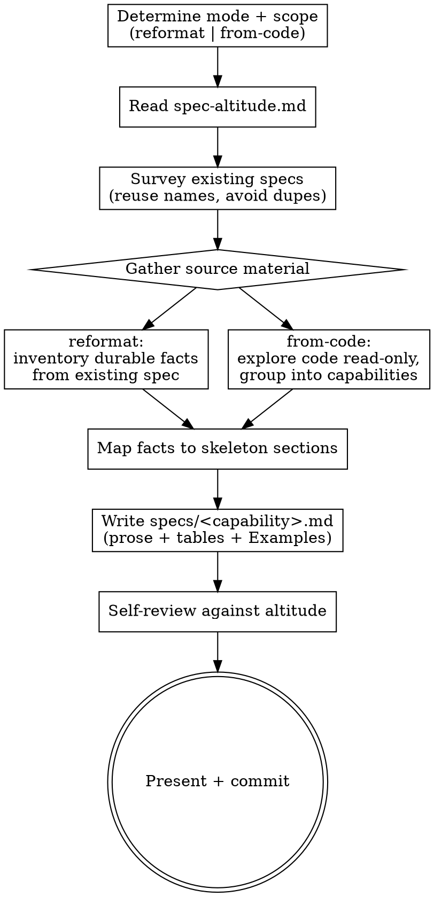

# Composing canonical specs

Write or rewrite the project's canonical specs (`.hamilton/specs/<capability>.md`) directly,
without running a change through the pipeline. This is the **front door for canonical specs**:
everywhere else, a spec is born only when `hamilton-finish-work` distills a completed change, so a
project adopting Hamilton — or one whose specs have drifted from the current format — has no way
to get well-formed specs. This skill fills that gap.

It has **two modes**:

- **reformat** — take an existing spec (often in the older `### Requirement:` / `#### Scenario:`
  form, or otherwise off-altitude) and rewrite it into the human-readable skeleton, preserving
  every durable fact.
- **from-code** — explore the application read-only, identify its capabilities, and author a
  canonical spec for each from what the code actually does.

Both modes write **canonical** specs: human-readable documentation at altitude, never the
change-side `SHALL` / `WHEN`/`THEN` delta form. Neither mode edits application code, and neither
creates a change directory — this skill operates only on `.hamilton/specs/`.

## What it produces

- `.hamilton/specs/<capability>.md`, one per capability, in the skeleton of
  `~/.hamilton/templates/requirements-spec.md`: `## Overview` / `## Contract` /
  `## Behavior` (+ **Examples**) / `## Invariants` / `## Decisions`.

## Inputs

- **The mode**, and its target:
  - reformat → one or more existing spec files, or the whole `.hamilton/specs/` directory.
  - from-code → the application (optionally scoped to a subsystem or a named capability).
- The project's existing `.hamilton/specs/` — to avoid duplication and reuse capability names.
- Project standards (`AGENTS.md`) — for the git workflow and any domain vocabulary.

If the mode is not given, infer it: an existing off-format spec as the target means reformat; a
codebase with no (or partial) specs means from-code. When ambiguous, ask.

## References

This skill ships with a `references/` folder. Read reference files using the Read tool on this
skill's own directory — they are co-located with this SKILL.md, **not** at `~/.hamilton/`.

- `references/spec-altitude.md` — the altitude rubric and the canonical spec's shape: the
  skeleton, the register→section mapping, the Examples-block treatment of scenarios, the voice,
  and what a canonical spec must not contain. This is the core of both modes — read it first.

## Principles

- **Altitude over mechanism.** State what the capability guarantees — contracts, behaviors,
  invariants, decisions — not the mechanism one commit used. Run every statement through the
  altitude test in `references/spec-altitude.md`.
- **Read like a human wrote it.** Plain technical documentation: prose and tables, natural voice,
  `MUST`/`NEVER` reserved for invariants. No `### Requirement:` / `#### Scenario:` scaffolding.
- **Preserve, don't invent (reformat).** Reformatting changes only shape and altitude — carry
  every durable fact across, drop only mechanism and scaffolding. Never silently lose a contract,
  behavior, invariant, or decision the old spec recorded.
- **Document what is true (from-code).** Describe the behavior the code actually exhibits, not
  what it should do. Where the code is ambiguous or you are inferring intent, say so rather than
  inventing a guarantee. Do not treat a bug as a contract.
- **Right-size capabilities.** One spec per coarse, durable domain a reader would recognize as a
  top-level concern — not a mechanism, a config surface, a single module, or a wiring step. Aim
  for the fewest capabilities that cover the system without overlap. (Same sizing as
  `hamilton-propose`: prefer `logging.md` over `structured-logging.md` + `trace-log-correlation.md`.)
- **Right-size sections.** Keep the skeleton sections a capability needs; omit the ones it has
  nothing for. A tiny capability may be an Overview and three Contract rows.

## Process

1. **Determine mode and scope.** Establish which mode you are in and its exact target (which
   files, or which part of the codebase). Read `references/spec-altitude.md` before writing
   anything.
2. **Survey existing specs.** List `.hamilton/specs/` so you reuse existing capability names and
   do not create an overlapping or duplicate spec.
3. **Gather the source material.**
   - **reformat:** read each target spec in full. Inventory the durable facts it holds — every
     contract, behavior, invariant, and decision — separating them from the mechanism and
     scaffolding you will drop.
   - **from-code:** explore the relevant code read-only (types, interfaces, handlers, schemas,
     config, tests). Tests and public interfaces are the richest source of black-box behavior.
     Group what you find into right-sized capabilities.
4. **Map to the skeleton.** For each capability, place each durable fact into its section using
   the register→section mapping: consumer-facing shapes (schemas, payloads, endpoints, config
   keys, field names and types) → `## Contract`; observable input→output → `## Behavior` plus an
   **Examples** bullet; properties that always hold → `## Invariants`; reusable rules → `## Decisions`;
   a one-paragraph orientation → `## Overview`.
5. **Write the spec.** Compose `.hamilton/specs/<capability>.md` from the template in flowing
   prose and tables. Add `### <subsection>` anchors under Contract/Behavior when a capability has
   several distinct surfaces (event types, endpoints). Fold behaviors into greppable Examples
   bullets (input → outcome). Keep the voice natural; use `MUST`/`NEVER` only in Invariants.
6. **Self-review against altitude.** Re-read each spec against `references/spec-altitude.md`:
   no control flow, no private names that are not the contract, no library calls, no file paths
   as requirements, nothing that could only be verified by reading source. For reformat, also
   confirm no durable fact from the original was lost. Fix in place.
7. **Present and commit.** Show the composed or reformatted specs for review. On approval (or,
   running unattended, after the self-review passes), commit following the project's git
   workflow. Reformatting a whole directory or bootstrapping a project is a large diff — group it
   into a sensible commit (e.g. one per capability, or one per run) per `AGENTS.md`.

## Boundaries

- Never edit application code, create a change directory, or run the change pipeline — this skill
  only reads code and writes `.hamilton/specs/`.
- Never emit the change-side `### Requirement:` / `#### Scenario:` / `SHALL` form into a canonical
  spec.
- Never drop a durable fact when reformatting; never invent a guarantee the code does not make
  when writing from code.
- Ask first when the mode or capability boundaries are genuinely ambiguous.

## Output

Canonical specs written to `.hamilton/specs/`, reviewed and committed per the project's git
workflow. Report which capabilities were created or reformatted, and any capability boundaries or
inferred behaviors you were unsure about.

## Process flow

