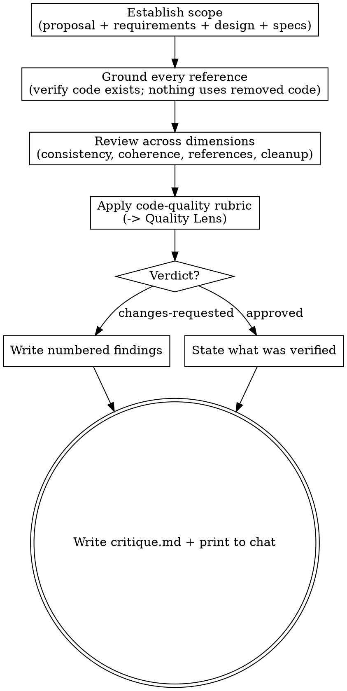

# Critiquing a change's artifacts

Review the proposal, requirements, and design a change committed to — before any code is
planned — and return a numbered findings report a person or agent can act on without
guessing which item you mean.

The **pipeline** is Hamilton's spec-driven sequence for a change: propose → plan → code →
review → finish-work. This skill is an **optional design-phase gate**: it critiques the
output of `hamilton-propose` before `hamilton-plan` turns it into tasks. It is the
design-phase counterpart to `hamilton-review` (which judges the code diff) — the cheapest
place to catch a design defect, since here nothing has been built yet.

**Judge, don't fix.** You produce a verdict and located findings. You never modify
`proposal.md`, `requirements/`, or `design.md`. The author revises and brings the artifacts
back; that loop is driven by whoever runs the pipeline, not by this skill.

## Inputs

- The change directory path (`.hamilton/changes/<change>/`).
- The propose artifacts under review: `proposal.md` (why), `requirements/<capability>.md`
  (what), `design.md` (how). Any subset that exists — a change may skip some.
- **The actual codebase.** Every reference the artifacts make — a type, function, file, or
  code example — must be checked against the real repository, not taken on trust.
- The project's canonical specs (`.hamilton/specs/`) — the current requirement truth each
  MODIFIED capability builds on.
- Project standards (`AGENTS.md`): idioms, ubiquitous language, boundaries.

## References

This skill ships with a `references/` folder. Read reference files using the Read tool on
the skill's own directory — they are co-located with this SKILL.md, **not** at
`~/.hamilton/` or `~/.hamilton/templates/`.

- `references/code-quality.md` — the design/plan-altitude rubric for judging structural
  quality, the same one `hamilton-propose` self-reviews against.

## Principles

- **Evidence over claims.** Trust the codebase, not the artifact's description of it. A
  design that says a type "is satisfied structurally" means nothing until you read the type
  and confirm the signatures line up.
- **Ground every reference.** The sharpest defect a design carries is a reference to code
  that does not exist, or no longer will. Verify each named type/function/file/example
  against the repository, and confirm nothing is planned against code the same change
  removes. This is a required step, not an optional pass.
- **Specific and located.** Every finding names the artifact and place, says what is wrong
  and what to change, and cites the criterion or standard it violates. "`design.md:126`
  claims `RapClient` satisfies `RAPStatusChecker`, but their `IsDone` return types differ"
  is useful; "the design is inconsistent" is not.
- **Numbered, most-severe first.** Findings are one continuous numbered list so any reply
  can pick an item by its number. Order the list by severity, tag each item, and keep the
  numbering stable within a pass.
- **Proportionate.** Scale scrutiny to the change (`references/code-quality.md` says how).
  Separate what blocks the gate from what is a suggestion; don't gold-plate a small change.
- **Scope-aware.** Flag speculative surface — unused methods, interfaces with one caller,
  extension points no requirement asks for — as YAGNI, the same way you would in code.

## Process

1. **Establish scope.** Read every propose artifact present (`proposal.md`,
   `requirements/`, `design.md`) and the canonical specs the change builds on. Note which
   capabilities are new vs modified vs removed — the removed set drives the cleanup check.
2. **Ground every reference in the codebase.** This is the load-bearing step. For each
   type, function, file, or code example the artifacts cite, read the real code and confirm
   it exists with the shape claimed — signatures, return types, field names, table names.
   Then check the other direction: nothing may be planned to modify, call, subclass, or
   use-as-example any code the change itself removes. A phantom reference or a change
   against deleted code is a blocking finding.
3. **Review across dimensions** (checklist below).
4. **Apply the structural rubric.** Run `design.md` and `requirements/` against
   `references/code-quality.md`, scaled to the change, and capture the outcome as a Quality
   Lens table (one row per principle you exercised).
5. **Decide a verdict:** `approved` or `changes-requested`.
6. **Write the report** — the numbered format below — printed to chat **and** persisted to
   `critique.md` in the change directory.

## Review dimensions

- **Logical consistency:** No artifact contradicts another or itself. Every described flow
  is complete — each step's inputs exist and line up with the previous step's outputs, and
  no step depends on a branch the design says can't happen.
- **Semantic coherence:** One term per concept across all artifacts (ubiquitous language).
  Names match the domain and the codebase; a struct, table, model, and file that refer to
  the same thing agree on how it is spelled and pluralized.
- **Code-reference validity:** Every referenced type/function/file/example exists in the
  codebase with the claimed signature and shape. No phantom references; no example that
  contradicts the real API it stands on.
- **Cleanup consistency:** Nothing is planned to modify, call, or use-as-example any
  type/function/code the change removes. When the change is a cleanup, list what it deletes
  and confirm no surviving step still leans on it — and that the deletion list is complete.
- **Structural quality:** Cohesion, coupling, testable seams, dependency direction,
  right-sized abstraction, intention-revealing names — judged against
  `references/code-quality.md`, scaled to the change. A smell baked into the design is a
  design defect to fix now, before it is inherited by every line of code.
- **Scope & YAGNI:** Unused methods, one-caller interfaces, speculative extension points,
  config knobs no requirement asks for. Cut now, add the seam when the second case arrives.
- **Completeness:** Placeholders, TODOs, ambiguity, and unresolved contradictions that
  would leave the planner or coder guessing.

## Report format

Write the report to `.hamilton/changes/<change>/critique.md`, following the
`~/.hamilton/templates/critique.md` format, and print the same content to chat. Findings are
**one continuous numbered list, ordered most-severe first**, each tagged
`[Critical]` (blocks the gate — a defect that would cause implementation confusion or a
runtime failure), `[Significant]` (a factual error or YAGNI violation to correct before the
gate), or `[Minor]` (a documentation or naming gap):

```
# Critique: <change> — <YYYY-MM-DD>

## Scope
<N artifacts cross-referenced against the codebase, the code-quality rubric, and each other>

Verdict: approved | changes-requested — <one line>

## Findings
1. **[Critical]** <title>
   - Where: <artifact:loc>, <artifact:loc>
   - Problem: <what is wrong and why>
   - Fix: <what to change; sub-number 1./2. when there are options>
2. **[Significant]** <title>
   - Where: ...
   - Problem: ...
   - Fix: ...
3. **[Minor]** <title>
   - ...

## Quality Lens
| Principle | Verdict | Notes |
| --- | --- | --- |
| <principle from code-quality.md> | ✅ / ⚠️ (→ finding N) / ❌ | <one line> |

## Summary
| Severity | Count | Items |
| --- | --- | --- |
| Critical | <n> | <finding numbers> |
| Significant | <n> | <finding numbers> |
| Minor | <n> | <finding numbers> |

**Recommendation:** <which findings block the gate; what can be deferred>
```

When the verdict is `approved`, replace the Findings list with a short note of what you
verified (artifacts cross-referenced, references confirmed against the codebase, rubric
clean).

## Output

`critique.md` written to the change directory and the same report printed to chat, with a
verdict and a numbered findings list. This skill does not modify `proposal.md`,
`requirements/`, `design.md`, or any code.

## Handoff

- **Name the next step, per the verdict.** On `approved`, the artifacts are ready for
  `hamilton-plan`. On `changes-requested`, they go back to the author (or `hamilton-propose`)
  to revise the flagged findings, then return here.
- **Hand back the decision.** Working with a person, state the verdict and ask whether to
  proceed rather than declaring readiness — and never invoke the next skill yourself.
  Running unattended, name the next step and return; the driver owns the loop.

## Process flow


