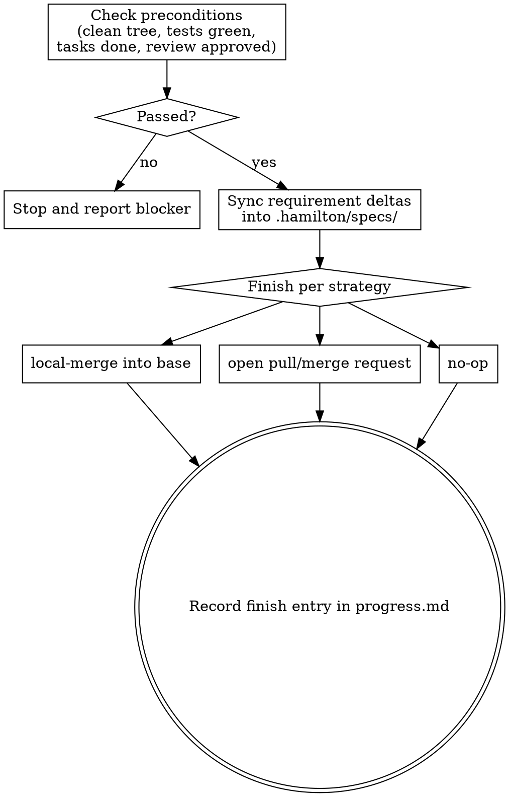

# Finishing a change

Close out a change: confirm it is done and clean, update the canonical specs to reflect the
new behavior, and complete it the way the project wants.

The **pipeline** is Hamilton's spec-driven sequence for a change: propose → plan → code →
review → finish-work. Each step is a skill a person or an agent can run. This skill is the
**finish-work** step — the last one.

## Inputs

- The change directory path (`.hamilton/changes/<change>/`): `plan.md`, `progress.md`,
  `review.md`, and `requirements/` if present.
- The finish strategy: `local-merge`, `pull-request`, or `no-op`. If unspecified, use the
  project's default or ask.
- Project standards (`AGENTS.md`): test/build commands, git workflow, branch and
  pull-request conventions, and the base branch.

## References

This skill ships with a `references/` folder. Read reference files using the Read tool on the
skill's own directory — they are co-located with this SKILL.md, **not** at `~/.hamilton/`.

- `references/spec-altitude.md` — the rubric for requirement altitude: what belongs in a
  canonical spec (contracts, behaviors, invariants, reusable patterns) and what must be lifted
  or dropped (mechanism, private names, library calls, file paths). Apply it in step 2.

## Principles

- **Gate before finishing.** Never complete a change that is not clean, green, and approved.
- **Specs are the truth.** Fold the change's requirement deltas into the canonical specs so
  they always describe current behavior.
- **Contracts, not mechanisms.** Fold requirements from the change's `requirements/` deltas
  **only** — never mint one from the diff, `progress.md`, `review.md`, or review comments — and
  distill each to altitude (`references/spec-altitude.md`) before it lands in the canonical spec.
- **Honest completion.** Never claim a merge or a pull request that did not happen.

## Process

1. **Check preconditions.** All must hold; if any fails, stop and report — finish nothing:
   - The working tree is clean (no uncommitted changes).
   - The full test suite and the build/typecheck pass.
   - Every task in `plan.md` is implemented (per `progress.md`).
   - The latest verdict in `review.md` is `approved`, with no unaddressed blocking items.
2. **Sync specs.** Fold each `requirements/<capability>.md` delta in the change into the
   canonical `.hamilton/specs/<capability>.md`. The change's `requirements/` deltas are the
   **only** source of canonical requirements: never create a requirement from the diff,
   `progress.md`, `review.md`, or external/MR review comments. Those record how the work was
   carried out, not what the capability guarantees — a review nit like "use a `switch`" or
   "extract constants" is mechanism, not a requirement. If review surfaced a genuinely missing
   *behavioral contract*, write it back as a delta requirement first, then fold that delta.
   The canonical spec is always in
   `~/.hamilton/templates/requirements-spec.md` form: a single `## Requirements` section
   holding the current requirement blocks. It **MUST NOT** contain any delta-group header —
   `## ADDED Requirements`, `## MODIFIED Requirements`, `## REMOVED Requirements`, or
   `## RENAMED Requirements`. Those headers exist only in the change delta. **Never copy a
   delta file verbatim into `specs/`** — unwrap its requirement blocks and place them under
   `## Requirements`. Apply each delta group to the canonical blocks:
   - **ADDED** → add the requirement block(s).
   - **MODIFIED** → replace the block whose `### Requirement:` name matches exactly; if the
     spec has no such block yet, add it.
   - **REMOVED** → delete the named block (drop its Reason/Migration — those stay in the
     change).
   - **RENAMED** → rename the header.
   If the capability has no canonical spec yet, create `.hamilton/specs/<capability>.md` from
   the template and populate its `## Requirements` section with every ADDED and MODIFIED block
   from the delta (regardless of which delta group they were authored under).
   Before writing each block into the canonical spec, **distill it to altitude** with
   `references/spec-altitude.md`: a delta may arrive bound to mechanism — control flow, private
   type/field/constructor names, library calls, or file paths. Drop that incident detail, lift
   the block to the contract, behavior, or invariant it serves, and merge reusable design rules
   into a single pattern requirement stated as a rule. The test: if a requirement's scenario
   could only be verified by reading the source rather than observing inputs and outputs, it is
   too low — lift it. The canonical spec states what the capability guarantees, not how one
   commit achieved it. Commit the spec update following the git workflow.
3. **Finish per strategy:**
   - **local-merge:** merge the change into the base branch following the project's workflow
     (e.g. squash), then clean up the branch if the workflow calls for it.
   - **pull-request:** push the branch and open a pull/merge request; take the title and
     body from `proposal.md` / `plan.md`.
   - **no-op:** leave the work as committed; finish without merging or opening a request.
4. **Record.** Append a finish entry to `progress.md` (format below).

## Boundaries

- Never finish with a dirty tree, failing tests, or an unapproved review — stop and report.
- Never edit code, or delete or weaken tests, to pass the gate.
- Never fabricate a merge or a pull request.
- Ask first: if no finish strategy was given and the project has no default.

## Progress entry

Append to `.hamilton/changes/<change>/progress.md` (see `~/.hamilton/templates/progress.md`):

```
## Finish — <YYYY-MM-DD>
- Preconditions: tree clean, tests green, review approved
- Specs synced: <capabilities created/updated>, or none
- Finished: local-merge into <base> | pull request <url> | no-op
```

## Output

Either a blocking report naming the precondition that failed (nothing finished), or:
the specs synced, the finish strategy carried out, and a `progress.md` finish entry.

## Process flow


