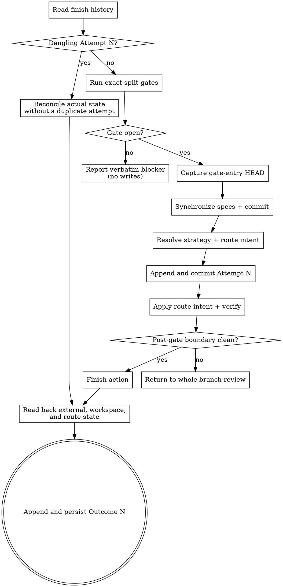

# Finishing a change

Close out a change only after its exact task evidence and whole-branch review open the finish
gate. Synchronize the canonical specifications, durably record the intended finish, carry out the
selected strategy, read the result back, and durably record what actually happened.

The **pipeline** is Hamilton's spec-driven sequence for a change: propose → plan → code →
review → finish-work. Each step is a skill a person or an agent can run. This skill is the
**finish-work** step — the last one.

## Inputs

- The change directory path (`.hamilton/changes/<change>/`) and its exact split-pipeline
  evidence:
  - `<change-dir>/plan.md` and the task-only root ledger at `<change-dir>/progress.md`.
  - The physically last implementation attempt in every active
    `<change-dir>/tasks/task-N/progress.md` and the physically last feedback pass in the matching
    `<change-dir>/tasks/task-N/feedback.md`.
  - The physically last whole-branch review pass in `<change-dir>/review.md`.
  - The append-only finish history at `<change-dir>/finish.md`, if it exists.
- The already approved specification inputs: `proposal.md`, `design.md`, and `requirements/`
  where present, plus the current canonical `.hamilton/specs/` documents.
- The `Route unit` field in `proposal.md` or the plan Overview, when the change executes a route
  unit, and that unit's exact `route.md` and `map.md` paths.
- The finish strategy: `local-merge`, `pull-request`, or `no-op`. If unspecified, use the
  project's explicit default or ask the user.
- Any explicit user waiver of material-change ancestry. Never infer one.
- Project standards from `AGENTS.md`: full test and build commands, base branch, git workflow,
  remote conventions, and pull- or merge-request tooling.

Reject a planned legacy layout instead of reconstructing it. Once `plan.md` exists, the root
ledger and every active task's linked progress and feedback artifacts must have the exact split
shape expected by the finish gate.

## References

This skill ships with a `references/` folder. Read reference files using the Read tool on the
skill's own directory — they are co-located with this `SKILL.md`, not at `~/.hamilton/`.

- `references/spec-altitude.md` — the altitude rubric and the canonical spec's human-readable
  skeleton (`## Overview` / `## Contract` / `## Behavior` with Examples / `## Invariants` /
  `## Decisions`). Apply it during specification synchronization.

## Principles

- **Gate before effects.** Do not synchronize specs, mutate a route, allocate an attempt, merge,
  push, open a request, or remove a workspace until the exact preconditions pass.
- **Physical evidence governs.** Use the exact root ledger and physically last task and review
  records. Never recover an earlier approval from history.
- **Intent before action; observation after action.** Commit an `Attempt N` before the first
  finish side effect. Read back every relevant effect before writing its matching `Outcome N`.
- **Finish history is paired and append-only.** The attempt says what will be done; the outcome
  says what was verified. Neither rewrites the other.
- **Specs are the truth.** Fold the approved requirement deltas into the canonical specs at
  human-readable altitude before attempting to finish.
- **Same-attempt ownership is narrow.** Expected canonical spec, route, map, and numbered finish
  mutations made by this skill do not invalidate the attempt whose gate admitted them. No other
  post-gate material edit receives that treatment.
- **Root progress is task state only.** Finish-work reads the root ledger but never changes root
  `progress.md` or any task-local execution artifact.
- **Honest completion.** Never infer an external effect from command success alone and never
  report a result that was not read back and persisted.

## Preconditions

For a new attempt, identify the complete test suite and build/typecheck commands from
`AGENTS.md`. Pass a command that runs both to the installed gate; do not guess or omit either:

```bash
~/.hamilton/scripts/hamilton-precondition-check.sh \
  --change-dir <change-dir> --test-cmd '<full test suite && build/typecheck>'
```

Use `--whole-change-waived` only for an explicit user waiver. The waiver changes only the
whole-branch review's material-change ancestry comparison. It does not waive the exact root task
ledger, task feedback, whole-branch review validity, verdict, blocking findings, range ancestry,
clean tree, or verification gates.

The script is authoritative. It must validate all of these facts and close with `gate: open`:

- The working tree is clean, and the full test suite and build/typecheck pass.
- The exact root task ledger has one ordered row for every active task, no extra row, the exact
  lowercase task-progress link, and status `done`. In every linked file, the physically last
  task attempt is well formed and has exactly one `Outcome: done`.
- Every active task's physically last task feedback pass is valid, fresh for its latest task
  progress commit, `approved`, on the current branch, and has no blocking findings or unresolved
  `cannot verify from diff` finding.
- The physically last whole-branch review pass is valid, on the current branch, `approved`, and
  has no blocking findings. Its reviewed range must be structurally valid. Unless explicitly
  waived, its Head must also contain the latest material change commit.

If the script is not installed, perform those exact checks by hand, including physical-last-pass
parsing and full commit ancestry. Fail closed on anything absent, malformed, contradictory,
unreachable, stale, or unverifiable.

If any gate fails, stop and report the gate output verbatim. Perform no finish action, do not
create or change `finish.md`, do not synchronize specs or route state, and do not write root
`progress.md`. A precondition failure has no finish-history record because no attempt began.

After the gate opens, capture the full gate-entry `HEAD`, branch, base branch, worktree path,
review Base and Head, latest material commit, waiver state, and route state. These values define
the admitted attempt and its post-gate mutation boundary.

## Specification synchronization

Run `~/.hamilton/scripts/hamilton-change-context.sh <change-dir>` to identify the approved change
artifacts and capability deltas. If the script is unavailable, list those paths directly. Before
editing a canonical spec, confirm that the approved proposal, design, and requirement deltas are
complete and mutually consistent. Treat them as read-only inputs throughout finish-work.

For each approved `requirements/<capability>.md`, read the current
`.hamilton/specs/<capability>.md` together with the delta, then draw durable rationale, decisions,
and reusable patterns from the approved `design.md` and `proposal.md`. Write canonical
`.hamilton/specs/` documents only from those already approved change artifacts.

The content set comes from those approved change artifacts. Never invent canonical behavior from
the raw diff, root or task progress, task feedback, whole-branch review comments, or an external
request. Never add, edit, or rewrite a file under `requirements/` during finish-work.

If synchronization discovers a missing or incorrect change requirement, abort before allocating
an attempt or committing canonical specs. Route the defect to artifact revision, then require a
fresh whole-branch review before finish-work runs again. The same stop applies when the proposal,
design, and requirement deltas disagree. Report the affected artifact and mismatch without
repairing approved intent inside the finish stage.

Write canonical specifications in the human-readable skeleton from
`~/.hamilton/templates/requirements-spec.md`. Never copy the change-side
Requirement/SHALL/Scenario shape or its delta-group headings into a canonical spec. Translate
each delta into its anchored contract surface:

- **ADDED** adds a contract row, behavior and Examples bullet, invariant, or decision.
- **MODIFIED** rewrites the affected section or subsection to the new behavior.
- **REMOVED** removes that behavior from its anchored section.
- **RENAMED** renames the public subsection anchor when the rename belongs in the spec.

If no canonical spec exists, create it from the template and populate every applicable ADDED and
MODIFIED behavior. Apply `references/spec-altitude.md`: discard private mechanism, preserve
consumer-visible persisted fields in `## Contract`, fold observable scenarios into Examples,
and state reusable rules once. Reserve `MUST` and `NEVER` for invariants.

When the change has no requirement delta, compare its touched capabilities with existing specs.
If behavior changed, treat the absent delta as a missing change requirement: abort for artifact
revision and fresh whole-branch review. Otherwise record that no canonical spec changed. A
tactical path does not permit spec drift.

Review the synchronization and stage only canonical `.hamilton/specs/` paths derived from the
already approved artifacts. If any changed, commit them before allocating the finish attempt,
verify the commit, and restore a clean tree. If none changed, record the verified no-change
`HEAD` instead of manufacturing an empty commit. Either result is an expected finish-owned
synchronization for this attempt, but it does not make an unrelated edit safe.

## Finish history

`<change-dir>/finish.md` is the only finish-history artifact. On the first admitted attempt,
instantiate the installed `finish.md` template: remove its instructions and placeholder pair,
set the real change title, and use the first real attempt as `Attempt 1`. Otherwise validate the
existing body before use. `finish.md` is append-only. Never alter or reorder a recorded attempt
or outcome, and never write root `progress.md`; finish work owns no root progress row or section.

Every pair uses `## Attempt N — <YYYY-MM-DD>` and `## Outcome N — <YYYY-MM-DD>`. For a fully
paired history, choose the next integer after the highest numbered Attempt or Outcome. Numbers
must be strictly monotonic, each number must occur once for each kind, and Outcome N must be the
matching observation for Attempt N. Reject duplicate, skipped, reordered, or malformed sections
before any action.

Append an attempt with all fields populated by durable identifiers and concrete intent:

    ## Attempt N — <YYYY-MM-DD>

    - Passed preconditions: <gate-entry HEAD, review range, material commit, verification, waiver>
    - Specification synchronization: <spec commit and capabilities, or verified none>
    - Strategy: <local merge | pull request | no-op>
    - Intended workspace result: <base/branch/worktree result>
    - Route intent: <exact unit and map transition, or none>

Append its outcome only after reading back the effect:

    ## Outcome N — <YYYY-MM-DD>

    - Result: completed | blocked
    - Verified external result: <observed merge, request, or no-op state and identifiers>
    - Actual workspace state: <observed branch and worktree state>
    - Actual route state: <observed unit and map state, or none>
    - Blockers or partial state: <none, or exact verified partial result>

The attempt and outcome are separate commits because the external result cannot be known before
the action. Commit the attempt on the change branch and verify that exact commit before the first
finish effect. Commit the matching outcome on the branch or base that survives the strategy and
verify it there. For a strategy with a remote branch, push and read back the persisted outcome.

## Resume and recovery

Read and validate `finish.md` before starting preconditions for a new attempt. If the physical
history ends with Attempt N without matching Outcome N, reconcile it before any new action or
attempt allocation. Inspect, in order, the relevant git commits and refs, remote branch, pull
request or merge request, route files, and workspace/worktree state. Do not trust an earlier
agent response or command's exit status.

Compare observed state with that attempt's recorded strategy and intent:

- If the intended result already happened, append the matching completed Outcome N and persist
  it on the surviving branch or base.
- If the action failed or left a stable partial result, append the matching blocked Outcome N
  with that verified state and persist it where it survives.
- If evidence proves the action did not start or can safely continue, continue the same attempt
  from the first unverified step. Revalidate its attempt commit and the post-gate mutation
  boundary first.
- If state is ambiguous or unsafe to modify, stop and report the dangling attempt without
  changing it.

Never allocate or execute a duplicate attempt before this reconciliation, and never renumber the
dangling attempt. After a blocked outcome, a later retry is a new attempt and must pass current
preconditions again.

## Post-gate mutation boundary

Capture the gate-entry `HEAD` and compare every later commit and working-tree path with it before
each finish effect. The only allowed post-gate changes are canonical `.hamilton/specs/` folding
derived from already approved artifacts, the exact route and map transition named by the
attempt, and the numbered `finish.md` mutations for that same `Attempt N` and `Outcome N`.

A change requirement is not finish-owned. Any post-gate edit to `proposal.md`, `design.md`, or
`requirements/` is an unrelated material edit, even if it appears to help synchronization.

Those finish-owned changes do not stale the same attempt. They are not a general freshness
exception and do not open a later attempt. An unrelated material edit, unexpected path, amended
reviewed commit, or unexplained dirty state must abort the attempt before the next effect and
return the change to whole-branch review. If an attempt commit already exists, persist a blocked
matching outcome when the verified repository state makes that safe. The ancestry waiver does
not excuse any post-gate mutation outside this allowlist.

## Process

1. **Inspect existing history.** Validate `finish.md`. If an attempt is dangling, follow
   **Resume and recovery** and do not enter a new-attempt path first.
2. **Run preconditions.** For a new attempt, run the exact gate in **Preconditions**. On failure,
   report its output without writing anything.
3. **Capture gate entry.** Record the full admitted identities and establish the post-gate
   allowlist.
4. **Persist specification synchronization.** After preconditions pass, validate the approved
   change artifacts, then synchronize canonical specifications at altitude. A missing or
   incorrect requirement returns to artifact revision and fresh whole-branch review without an
   attempt. Otherwise commit and verify only changed `.hamilton/specs/` paths, or verify the
   no-change `HEAD`, then check the mutation boundary.
5. **Resolve intent.** Detect the workspace with
   `~/.hamilton/scripts/hamilton-isolate.sh --check`, resolve the actual base branch and selected
   strategy, and identify any exact route and map transitions. Ask if the strategy is still
   unspecified and no project default exists.
6. **Commit intent.** Append `Attempt N` with Passed preconditions, Specification
   synchronization, Strategy, Intended workspace result, and Route intent. Commit that attempt
   alone on the change branch, verify the commit contains the expected finish path, and confirm
   it is reachable from the branch. This commit must exist before any external finish action.
7. **Apply route intent.** If route-backed, update only the named unit from `in-progress` to
   `shipped`; update the map from `shipping` to `shipped` only when every unit is verified
   shipped. Commit the exact route/map paths and read them back. If not route-backed, record no
   route mutation.
8. **Check the boundary.** Reinspect all post-gate commits and working-tree paths. Abort on any
   mutation not owned by this attempt.
9. **Execute the strategy.** Follow exactly one branch in **Strategy execution**. Treat the
   first route mutation, push, request creation, merge, worktree removal, or no-op verification
   as an action that requires the attempt commit already to exist.
10. **Read back actual state.** Query git, the request provider when applicable, the worktree
    list, and route files. Collect actual identifiers and states; do not draft the outcome from
    intended values.
11. **Persist the outcome.** Append the matching `Outcome N` as `completed` only when every
    intended effect was verified, otherwise as `blocked` with the verified partial state. Commit
    it on the surviving branch or base. Push and read it back when a remote branch participates.
12. **Report.** Re-read the persisted pair and disclose only the verified external, workspace,
    route, branch, request, and history state.

## Strategy execution

- **local-merge:** From the main checkout, merge the change branch including the verified
  attempt commit and any route commit into the resolved base branch according to the project's
  workflow. Never remove a worktree from inside itself. Remove the linked worktree and delete the
  change branch only when the project workflow calls for it. Then read back the base ref and
  workspace list: verify the base contains the attempt and route state, the merge result is
  present, and the worktree is absent when removal was intended. Append the matching `Outcome N`
  on the base branch, commit it there, and verify that commit and pair on the base. If the base is
  pushed by the workflow, push the outcome commit and verify the remote base ref too.
- **pull-request:** Push the change branch containing the attempt and route state, verify the
  remote ref, then open the pull request or merge request using the approved change artifacts.
  Read back its canonical URL, open state, head commit, and base branch from the provider. Leave
  the branch and worktree in place. Append the matching `Outcome N`, commit it on the change
  branch, push that commit, and verify the request head and remote branch include the outcome
  commit. A locally committed outcome that did not reach the remote request is blocked, not
  completed.
- **no-op:** Perform no merge, push, request creation, branch deletion, or worktree removal.
  Verify that the intended branch and worktree remain and that route intent, if any, is committed.
  Append the matching `Outcome N` on the unchanged change branch, commit it there, then re-read
  the branch, worktree, route, and paired history before reporting completion.

## Partial failure

When a command fails after the finish action begins, stop issuing forward actions and inspect the
actual partial state. Determine which commits, refs, remote objects, route transitions, and
workspaces really exist. Never infer rollback or success.

When safe, append the matching Outcome N as `blocked`, name every verified effect and missing
effect, and commit it on the surviving branch or base. If a remote branch exists, push and read
back the blocked outcome from the remote when possible; if persistence or push fails, report that
exact fact and leave the attempt for recovery. Never report the attempt as completed, and never
allocate a replacement attempt during the same recovery.

## Boundaries

- Never edit application code or delete, weaken, or rewrite tests to open the gate.
- Never write finish state into root `progress.md`, task progress, task feedback, or root review.
- Never create an attempt before the gates and committed spec synchronization.
- Never begin a route or strategy effect before the attempt commit is verified.
- Never overwrite, reorder, pair loosely, or backfill finish history from memory.
- Never remove a worktree from inside it.
- Never fabricate a merge, request, route transition, workspace removal, pushed commit, or
  persisted outcome.
- Ask first when no finish strategy is supplied and project standards provide no default.

## Output

Before an action begins, output is either the verbatim gate blocker with no writes or a request
for the missing strategy. After an attempt begins, report its number, the verified external
result, actual route and workspace state, surviving branch or base, and the commit containing the
persisted Outcome N. Include the verified request URL and remote head for a pull-request strategy.

Never claim a merge, pull request, no-op, route transition, workspace removal, or outcome until
that specific result has been read back. If outcome persistence itself failed, say that the
attempt remains dangling instead of describing an unpersisted result as history.

## Process flow


```dot
digraph hamilton_finish_work {
    "Read finish history" [shape=box];
    "Dangling Attempt N?" [shape=diamond];
    "Reconcile actual state\nwithout a duplicate attempt" [shape=box];
    "Run exact split gates" [shape=box];
    "Gate open?" [shape=diamond];
    "Report verbatim blocker\n(no writes)" [shape=box];
    "Capture gate-entry HEAD" [shape=box];
    "Synchronize specs + commit" [shape=box];
    "Resolve strategy + route intent" [shape=box];
    "Append and commit Attempt N" [shape=box];
    "Apply route intent + verify" [shape=box];
    "Post-gate boundary clean?" [shape=diamond];
    "Finish action" [shape=box];
    "Read back external, workspace,\nand route state" [shape=box];
    "Append and persist Outcome N" [shape=doublecircle];
    "Return to whole-branch review" [shape=box];

    "Read finish history" -> "Dangling Attempt N?";
    "Dangling Attempt N?" -> "Reconcile actual state\nwithout a duplicate attempt" [label="yes"];
    "Dangling Attempt N?" -> "Run exact split gates" [label="no"];
    "Run exact split gates" -> "Gate open?";
    "Gate open?" -> "Report verbatim blocker\n(no writes)" [label="no"];
    "Gate open?" -> "Capture gate-entry HEAD" [label="yes"];
    "Capture gate-entry HEAD" -> "Synchronize specs + commit";
    "Synchronize specs + commit" -> "Resolve strategy + route intent";
    "Resolve strategy + route intent" -> "Append and commit Attempt N";
    "Append and commit Attempt N" -> "Apply route intent + verify";
    "Apply route intent + verify" -> "Post-gate boundary clean?";
    "Post-gate boundary clean?" -> "Return to whole-branch review" [label="no"];
    "Post-gate boundary clean?" -> "Finish action" [label="yes"];
    "Finish action" -> "Read back external, workspace,\nand route state";
    "Read back external, workspace,\nand route state" -> "Append and persist Outcome N";
    "Reconcile actual state\nwithout a duplicate attempt" -> "Read back external, workspace,\nand route state";
}
```
