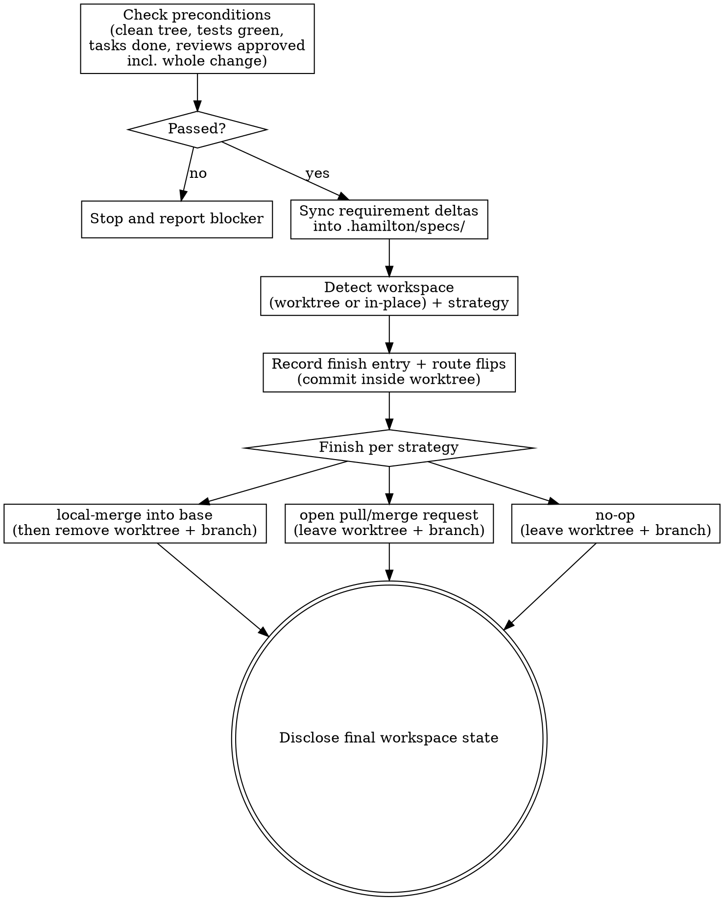

# Finishing a change

Close out a change: confirm it is done and clean, update the canonical specs to reflect the
new behavior, and complete it the way the project wants.

The **pipeline** is Hamilton's spec-driven sequence for a change: propose → plan → code →
review → finish-work. Each step is a skill a person or an agent can run. This skill is the
**finish-work** step — the last one.

## Inputs

- The change directory path (`.hamilton/changes/<change>/`): `plan.md`, `progress.md`,
  `review.md`, and — as the material distilled into the canonical specs — `proposal.md`,
  `design.md`, and `requirements/` where present.
- The `Route unit` field in `proposal.md` (or plan.md's Overview), when the change executes a
  route unit — step 4 uses it to flip the unit's status.
- The finish strategy: `local-merge`, `pull-request`, or `no-op`. If unspecified, use the
  project's default or ask.
- Project standards (`AGENTS.md`): test/build commands, git workflow, branch and
  pull-request conventions, and the base branch.

## References

This skill ships with a `references/` folder. Read reference files using the Read tool on the
skill's own directory — they are co-located with this SKILL.md, **not** at `~/.hamilton/`.

- `references/spec-altitude.md` — the altitude rubric **and** the canonical spec's shape: the
  human-readable skeleton (`## Overview` / `## Contract` / `## Behavior` + Examples /
  `## Invariants` / `## Decisions`), what belongs in each section (contracts, behaviors,
  invariants, decisions/patterns), the Examples-block treatment of scenarios, and what stays
  behind in the change artifacts (mechanism, private names, library calls, file paths). Change
  artifacts may be specific and use the Requirement/Scenario form; the canonical spec is neither.
  Apply it in step 2.

## Principles

- **Gate before finishing.** Never complete a change that is not clean, green, and approved.
- **Specs are the truth.** Fold the change's requirement deltas into the canonical specs so
  they always describe current behavior.
- **Canonical specs are distilled, not copied.** The canonical spec is the project's durable
  body of knowledge — contracts, behaviors, invariants, decisions — written at altitude and read
  like documentation a human wrote (the skeleton in `references/spec-altitude.md`), not the
  change-side Requirement/SHALL/Scenario form. Distill it from the change's deliberate artifacts
  (`proposal.md`, `design.md`, `requirements/`), never from the raw diff, `progress.md`, or
  review comments. The change artifacts may be as specific as they need to be; the canonical spec
  states what the capability guarantees, not the mechanism one commit used.
- **Honest completion.** Never claim a merge or a pull request that did not happen.
- **Leave no orphan workspace, and disclose where the work landed.** If the change was done in
  a worktree, it is torn down on local-merge and left-but-named otherwise. The user always
  learns the final workspace state — which branch it merged into, or where the branch and
  worktree still live.

## Process

1. **Check preconditions.** Run the gate:

   ```bash
   ~/.hamilton/scripts/hamilton-precondition-check.sh \
     --change-dir <change-dir> --test-cmd '<the test command from AGENTS.md>'
   ```

   Pass `--whole-change-waived` only when the user has explicitly waived the whole-change
   review. The script prints one line per gate and closes with `gate: open` or
   `gate: closed (N failing)`; if it exits non-zero, **stop and report its output verbatim** —
   finish nothing. That output is the blocking report; do not paraphrase it or re-derive the
   failures yourself.

   If the script is not installed (`hamilton setup` has not run), check the same five things by
   hand — all must hold:
   - The working tree is clean (no uncommitted changes).
   - The full test suite and the build/typecheck pass.
   - Every task in `plan.md` is implemented (per `progress.md`).
   - In `review.md`, every task's latest verdict is `approved`, with no unaddressed blocking items.
   - A `whole change` review newer than the last code commit is `approved`. Per-task approvals
     alone never open the gate: to finish without a whole-change review, the user must say so
     explicitly, and the waiver is recorded in the finish entry.
2. **Sync specs — distill and translate.** First see what you have to distill from:
   `~/.hamilton/scripts/hamilton-change-context.sh <change-dir>` lists which artifacts exist and
   names the capabilities under `requirements/` (list the directory yourself if the script is
   not installed). Then fold the change into the canonical
   `.hamilton/specs/<capability>.md`, working from each `requirements/<capability>.md` delta and
   drawing rationale, decisions, and reusable patterns from `design.md` and `proposal.md`. The
   content *set* comes from these deliberate change artifacts — never invent canonical content
   from the raw diff, `progress.md`, or external/MR review comments. Those record how the work
   was carried out; a review nit like "use a `switch`" or "extract constants" is mechanism, not a
   durable contract. If review surfaced a genuinely missing *behavior*, write it back as a delta
   first, then distill that.

   The canonical spec is **not** in the change-side Requirement/SHALL/Scenario form. It is
   human-readable documentation in the skeleton of `~/.hamilton/templates/requirements-spec.md`:
   `## Overview` / `## Contract` / `## Behavior` (with a greppable **Examples** block) /
   `## Invariants` / `## Decisions`, in flowing prose and tables, at altitude. It **MUST NOT**
   contain any delta-group header (`## ADDED Requirements`, `## MODIFIED …`, `## REMOVED …`,
   `## RENAMED …`) or `### Requirement:` / `#### Scenario:` blocks — those live only in the
   change delta. **Never copy a delta file verbatim into `specs/`.** Instead **translate**: read
   the capability's current canonical spec (if any) together with the change's deltas, and apply
   each delta to the **anchored section** its behavior belongs to. A delta's `### Requirement:`
   name and its scenarios are *input* — use them to locate the section or `### <subsection>`
   anchor (an event type, an endpoint, a config group) to update, not as headings to reproduce:
   - **ADDED** → add the new contract row/table, behavior sentence + Examples bullet, invariant,
     or decision to the section it belongs to — creating a `### <subsection>` anchor if it is a
     new, distinct contract surface.
   - **MODIFIED** → rewrite the affected section or subsection to the new behavior.
   - **REMOVED** → drop that behavior from its section (delete the row, the Examples bullet, or
     the whole subsection); its Reason/Migration stay in the change.
   - **RENAMED** → rename the subsection anchor if the rename surfaces in the spec.
   If the capability has no canonical spec yet, create `.hamilton/specs/<capability>.md` from the
   template and populate every applicable section from the ADDED and MODIFIED blocks (regardless
   of which delta group they were authored under), omitting sections the capability has nothing
   for.

   Before writing, **distill each delta to altitude** with `references/spec-altitude.md`: a delta
   may arrive bound to mechanism — control flow, private type/field/constructor names, library
   calls, or file paths. Drop that incident detail (private field names stay out unless they are
   the consumer-facing contract — a persisted schema, a payload, a request/response body — in
   which case they belong in `## Contract` as a field table); lift each statement to the
   contract, behavior, invariant, or decision it serves; fold surviving `WHEN`/`THEN` scenarios
   into the **Examples** block as input → outcome bullets; and merge reusable design rules into a
   single stated-as-a-rule decision. The test: if a statement could only be verified by reading
   the source rather than observing inputs and outputs, it is too low — lift it or drop it.
   Reserve `MUST`/`NEVER` for `## Invariants`. The canonical spec states what the capability
   guarantees, not how one commit achieved it. Commit the spec update following the git workflow.

   When the change has no `requirements/` deltas (the minimal path), do not record "none" and
   move on: check the diff's touched capabilities against `.hamilton/specs/`. If the change
   alters behavior a spec documents, write the delta retroactively and fold it — or flag it
   and stop. A tactical change that skips ceremony must not let the specs drift.
3. **Detect the workspace.** Run `~/.hamilton/scripts/hamilton-isolate.sh --check`: its `mode:`
   line reads `linked-worktree` or `in-place-branch`, and `root:` and `branch:` give you the
   path and branch to disclose. On `linked-worktree` plus local-merge, you will also remove it;
   `in-place-branch` means there is nothing to tear down. Without the script, read the same
   facts from `git rev-parse --git-dir` versus `--git-common-dir` (a worktree),
   `git rev-parse --show-toplevel`, and `git rev-parse --abbrev-ref HEAD`. Decide the strategy
   now (from the input, the project default, or by asking), so the finish entry can record it.
4. **Record.** Append a finish entry to `progress.md` (format below), stating the chosen strategy
   and the intended workspace outcome, and commit it **before finishing** — and, if you are in a
   worktree, before any local-merge teardown — so it merges into the base branch with the rest of
   the change. If the change is route-backed — a `Route unit` field in `proposal.md` or in
   plan.md's Overview — also flip that unit's `Status:` to `shipped` in the map's `route.md`, and,
   if every other unit is already `shipped`, flip the map's `status:` to `shipped`; commit the
   flips with the finish entry and record them there.
5. **Finish per strategy.**
   - **local-merge:** merge the change branch into the base branch following the project's
     workflow (e.g. squash), then remove the worktree (`git worktree remove <path>`) and delete
     the change branch if the workflow calls for it. **You cannot remove a worktree from inside
     it** — run the merge and the removal from the main checkout (the working tree whose `.git`
     is `git rev-parse --git-common-dir`). Report the base branch the work landed on.
   - **pull-request:** push the branch and open a pull/merge request; take the title and
     body from `proposal.md` / `plan.md`. Leave the worktree and branch in place — the request
     needs the branch and the author may keep iterating — and report both the request URL and
     the worktree path.
   - **no-op:** leave the work as committed in the worktree; finish without merging or opening
     a request. Report the worktree path and branch so the work can be found.

## Boundaries

- Never finish with a dirty tree, failing tests, or an unapproved review — stop and report.
- Never edit code, or delete or weaken tests, to pass the gate.
- Never fabricate a merge or a pull request.
- Never remove a worktree from inside it — do the removal from the main checkout.
- Ask first: if no finish strategy was given and the project has no default.

## Progress entry

Append to `.hamilton/changes/<change>/progress.md` (see `~/.hamilton/templates/progress.md`):

```
## Finish — <YYYY-MM-DD>
- Preconditions: tree clean, tests green, reviews approved (whole change) | whole-change review waived by user
- Specs synced: <capabilities created/updated>, or none
- Finished: local-merge into <base> | pull request <url> | no-op
- Workspace: worktree <path> removed | worktree left at <path> (branch <branch>) | worked in place
- Route: unit <N> shipped (map shipped) | unit <N> shipped | not route-backed
```

## Output

Either a blocking report naming the precondition that failed (nothing finished), or:
the specs synced, the finish strategy carried out, and a `progress.md` finish entry. Close by
disclosing where the work landed — the base branch it merged into and that the worktree was
removed, or the request URL and the worktree/branch left in place, or the no-op location — so
the user is never left guessing which workspace holds the change.

## Process flow


```dot
digraph hamilton_finish_work {
    "Check preconditions\n(clean tree, tests green,\ntasks done, reviews approved\nincl. whole change)" [shape=box];
    "Passed?" [shape=diamond];
    "Stop and report blocker" [shape=box];
    "Sync requirement deltas\ninto .hamilton/specs/" [shape=box];
    "Detect workspace\n(worktree or in-place) + strategy" [shape=box];
    "Record finish entry + route flips\n(commit inside worktree)" [shape=box];
    "Finish per strategy" [shape=diamond];
    "local-merge into base\n(then remove worktree + branch)" [shape=box];
    "open pull/merge request\n(leave worktree + branch)" [shape=box];
    "no-op\n(leave worktree + branch)" [shape=box];
    "Disclose final workspace state" [shape=doublecircle];

    "Check preconditions\n(clean tree, tests green,\ntasks done, reviews approved\nincl. whole change)" -> "Passed?";
    "Passed?" -> "Stop and report blocker" [label="no"];
    "Passed?" -> "Sync requirement deltas\ninto .hamilton/specs/" [label="yes"];
    "Sync requirement deltas\ninto .hamilton/specs/" -> "Detect workspace\n(worktree or in-place) + strategy";
    "Detect workspace\n(worktree or in-place) + strategy" -> "Record finish entry + route flips\n(commit inside worktree)";
    "Record finish entry + route flips\n(commit inside worktree)" -> "Finish per strategy";
    "Finish per strategy" -> "local-merge into base\n(then remove worktree + branch)";
    "Finish per strategy" -> "open pull/merge request\n(leave worktree + branch)";
    "Finish per strategy" -> "no-op\n(leave worktree + branch)";
    "local-merge into base\n(then remove worktree + branch)" -> "Disclose final workspace state";
    "open pull/merge request\n(leave worktree + branch)" -> "Disclose final workspace state";
    "no-op\n(leave worktree + branch)" -> "Disclose final workspace state";
}
```
