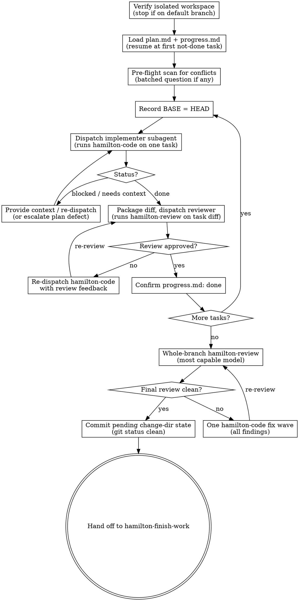

# Orchestrating a plan

Drive an entire `plan.md` to completion by dispatching one fresh subagent per task. Each
implementer subagent runs the **hamilton-code** skill on a single task; each is followed by
a **hamilton-review** pass on that task's diff; and after the last task a broad whole-branch
review runs before the work is finished.

The **pipeline** is Hamilton's spec-driven sequence for a change: propose → plan → code →
review → finish-work. Each step is a skill a person or an agent can run. This skill is the
**driver** for the code and review steps: it does not add a new step, it runs the existing
ones across every task in the plan, in one session, without a human in the loop between
tasks.

**Why subagents.** You delegate each task to a fresh agent whose whole job is to run
`hamilton-code` on that one task. It never inherits this session's history — you hand it
only the plan path and the task id, and `hamilton-code` reads just its own task. Fresh
context per task keeps implementers focused and keeps *your* context free for coordination.

**Core principle.** Fresh subagent per task (hamilton-code) + a hamilton-review pass per
task + one broad whole-branch review = high quality, fast iteration.

**Continuous execution.** Do not pause to check in between tasks. Execute every task in the
plan, in order, without stopping. The only reasons to stop are a blocker you cannot resolve,
an ambiguity that genuinely prevents progress, or all tasks complete. "Should I continue?"
prompts and progress summaries waste the user's time — they asked you to run the plan, so
run it.

**You coordinate; you never implement.** This skill never edits production code, never edits
`plan.md`, and never runs a task's steps itself. All of that happens inside subagents. Your
tools are: read the plan, dispatch, read reports, adjudicate, track progress.

## Inputs

- A change directory at `.hamilton/changes/<YYYY-MM-DD-title>/` containing `plan.md` — the
  ordered task ledger produced by `hamilton-plan`.
- Project standards (`AGENTS.md`): test/build commands, code style, git workflow, boundaries.
- Optional: `design.md` / `requirements/` in the change dir — the source of the binding
  constraints you pass to reviewers.
- `progress.md` in the change dir, if it exists — the durable record of which tasks are
  already done (see **Durable progress**).

## References

This skill ships with a `references/` folder. Read reference files with the Read tool on the
skill's own directory — they are co-located with this SKILL.md.

- `references/implementer-prompt.md` — template for dispatching a hamilton-code subagent.
- `references/reviewer-prompt.md` — template for dispatching a hamilton-review subagent.

## Principles

- **One task per subagent, by reference.** Dispatch the plan path and the task id; let
  `hamilton-code` read only its own task. Never paste the whole plan, and never paste
  accumulated summaries of earlier tasks — a fresh subagent needs its task, the interfaces
  earlier tasks established, and the binding constraints. Nothing else.
- **Never edit; only dispatch.** Findings are fixed by re-dispatching `hamilton-code` with
  the review feedback — not by you editing files. Editing in the controller pollutes your
  context and defeats the isolation.
- **Trust the ledger, not memory.** `progress.md` and `git log` are the source of truth for
  what is done. After any compaction, resume from them (see **Durable progress**).
- **Hand artifacts over as files.** Diffs and reports move as file paths, not pasted text,
  so bulk content never sits resident in your context (see **File handoffs**).
- **Specify the model on every dispatch.** An omitted model silently inherits this session's
  — usually the most capable and most expensive one. Choose per **Model selection**.

## Process

1. **Verify an isolated workspace.** `hamilton-plan` normally leaves you in a worktree or on
   a dedicated branch. Confirm it: if `git rev-parse --git-dir` differs from
   `--git-common-dir` (a linked worktree) or you are on a branch other than the repo's
   default, proceed. If you are on the default branch, **stop and ask** — never start
   dispatching implementers onto `main`/`master` without explicit consent.
2. **Load the plan and resume point.** Read `plan.md` for the task list, the Overview's
   context, and the Global Constraints / Quality notes. Read `progress.md`: any task with
   `Outcome: done` is complete — do not re-dispatch it. Resume at the first task not marked
   done.
3. **Pre-flight scan (once, before Task 1).** Scan the plan for internal conflicts: tasks
   that contradict each other or the plan's constraints, or anything the plan mandates that
   a review would treat as a defect (a test asserting nothing, verbatim duplication of a
   logic block). Present everything you find to the user as one batched question — each
   finding beside the plan text that mandates it — before execution begins. If the scan is
   clean, proceed without comment.
4. **Per task, in order** (skipping tasks already `done`):
   1. **Record BASE** = current `HEAD` (`git rev-parse HEAD`). This is the diff base for the
      task — never `HEAD~1`, which drops all but the last commit of a multi-commit task.
   2. **Dispatch the implementer** (see `references/implementer-prompt.md`): a fresh subagent
      whose whole job is to run `hamilton-code` on this task, by reference — the change
      directory path and the task id. Give it a one-line scene-setting note, the interfaces
      or decisions from earlier tasks it needs, and the report-file path. Nothing more.
   3. **Handle its status** (see **Handling implementer status**). If it asks a question,
      answer completely before it proceeds.
   4. **Package the diff.** Record `HEAD` and write the task's diff to a uniquely named
      scratch file (see **File handoffs**).
   5. **Dispatch the reviewer** (see `references/reviewer-prompt.md`): a fresh subagent that
      runs `hamilton-review` on the task's diff, with the binding constraints copied verbatim
      from the plan. It judges only; it returns a verdict and located feedback.
   6. **Adjudicate.** If the review requests changes, re-dispatch `hamilton-code` on the
      **same task** with the review feedback attached (`hamilton-code` accepts prior-pass
      feedback as an input and addresses it in place), then re-package the diff and
      re-review. Loop until the reviewer approves. Resolve any "cannot verify from diff" item
      yourself — you hold the cross-task context the reviewer lacks; a confirmed gap is a
      failed review, so send it back.
   7. **Record progress.** `hamilton-code` already appended a `progress.md` entry; confirm it
      reads `Outcome: done`. That entry is your durable mark of completion.
5. **Broad whole-branch review.** After the last task, dispatch one `hamilton-review`
   subagent over the entire branch diff (`git merge-base <default-branch> HEAD`..`HEAD`),
   with the whole change's requirements and design as context. This is the merge gate the
   per-task passes are not.
6. **Fix the final review as one wave.** If it returns findings, dispatch **one**
   `hamilton-code` subagent with the complete findings list — not one fixer per finding — then
   re-review the affected range.
7. **Commit any pending change-dir state, then hand off to finish-work.** Before handing off,
   run `git status` and confirm the change directory is fully committed. Each `hamilton-code`
   subagent commits its own `progress.md`, but the whole-branch review and final fix wave can
   leave change-dir artifacts (e.g. `progress.md`) uncommitted — if any remain, commit them
   with a bookkeeping message so nothing under `.hamilton/changes/<change>/` is left in the
   working tree. This commit is the one exception to "never touch the tree": it moves no
   production code, only the change-dir ledger. When the whole-branch review is clean and the
   change dir is committed, the plan's "Done when" is satisfied. Stop here and hand off to
   **hamilton-finish-work** to complete the branch; do not merge or open a PR from this skill.

## Handling implementer status

`hamilton-code` reports its outcome. Handle each:

- **Done** (`progress.md` says `Outcome: done`, suite and build green): proceed to the diff
  package and review.
- **Blocked** (`Outcome: blocked`, or the subagent reports it cannot complete): read the
  blocker. If it is missing context, provide it and re-dispatch with the same model. If the
  task needs more reasoning, re-dispatch with a more capable model. If the task is too large,
  it is a plan defect — escalate to the user rather than improvising a split (this skill does
  not edit `plan.md`). Never force the same model to retry with nothing changed.
- **Asks a question before or during work:** answer clearly and completely, then let it
  proceed. Do not rush it into implementation.

## Model selection

Use the least powerful model that can do each role — turn count and wall-clock cost more than
token price, so avoid a cheap model that will thrash.

- **Implementer (hamilton-code):** the plan already carries the design and exact steps, so
  most tasks are transcription-plus-testing — a **fast, cheap** model is the floor. Use a
  **standard** model when the task touches many files or has real integration concerns.
- **Task reviewer (hamilton-review):** a **standard** model, scaled to the diff — a subtle
  concurrency or contract change warrants the most capable model; a one-file mechanical diff
  does not.
- **Final whole-branch review:** the **most capable** model available. It is the merge gate.

Specify the model explicitly on every dispatch.

## Durable progress

Conversation memory does not survive compaction; re-dispatching completed tasks is the most
expensive failure. Hamilton already gives you a durable ledger: **`progress.md`** in the
change directory, appended by every `hamilton-code` run.

- At skill start, and after any compaction or resume, read
  `.hamilton/changes/<change>/progress.md`. Every task whose newest entry says
  `Outcome: done` is complete — do not re-dispatch it. Cross-check with `git log`: the
  commits it names exist even when your context no longer remembers creating them.
- Trust the ledger and `git log` over your own recollection.
- `progress.md` is committed with the change, so it survives `git clean`; if it is ever lost,
  recover the completion state from `git log`.

## File handoffs

Everything you paste into a dispatch, and everything a subagent prints back, stays resident
in your context for the rest of the session. Move bulk artifacts as files:

- **Diff package:** before dispatching a reviewer, write the task's diff to a uniquely named
  scratch file — `git diff --stat BASE..HEAD` and `git diff -U10 BASE..HEAD` redirected into
  one file (e.g. under the system temp dir) — and pass the reviewer the path. Use the BASE
  you recorded before the implementer ran; never `HEAD~1`.
- **Report file:** name each subagent's report file after its task and put the path in the
  dispatch. The subagent writes its full report there and returns only status, commits, a
  one-line test summary, and concerns.
- **Reviewer inputs:** the reviewer gets the diff-package path, the report path, and the
  binding constraints copied verbatim from the plan — not this session's history.

## Constructing reviewer dispatches

- Copy the binding requirements **verbatim** from the plan's Global Constraints / Quality
  notes (or the design): exact values, formats, and the stated relationships between
  components. That block is the reviewer's attention lens; `hamilton-review`'s own rubric
  already carries the process rules.
- Never pre-judge findings — do not tell a reviewer what not to flag or pre-rate a severity.
  If you think a finding would be a false positive, let it be raised and adjudicate it in the
  loop. A finding that conflicts with what the plan mandates is the user's decision: present
  the finding beside the plan text and ask which governs.
- Do not ask a reviewer to re-run tests the implementer already ran on the same code — the
  report carries that evidence.

## Boundaries

- Always: verify workspace isolation before Task 1; specify a model on every dispatch;
  confirm each task's `progress.md` entry before moving on; confirm the change directory is
  fully committed before handing off to finish-work.
- Ask first: starting on the default branch; any plan-mandated finding a review flags as a
  defect; a blocker that implies the plan itself is wrong.
- Never: edit production code or `plan.md` yourself; dispatch two implementers in parallel
  (they conflict on the working tree); paste the whole plan or prior-task history into a
  dispatch; skip the per-task review or accept "close enough" on it; re-dispatch a task
  `progress.md` already marks done.

## Output

Every task in the plan implemented by its own `hamilton-code` subagent, each passing a
`hamilton-review` gate; a clean whole-branch review; a `progress.md` with a `done` entry per
task, fully committed with the rest of the change directory; and the branch ready for
**hamilton-finish-work**. This skill writes no production code and never modifies `plan.md`.
If anything is unresolved — a blocker, a plan defect, an unadjudicated plan-mandated finding —
state it plainly and stop.

## Process flow

