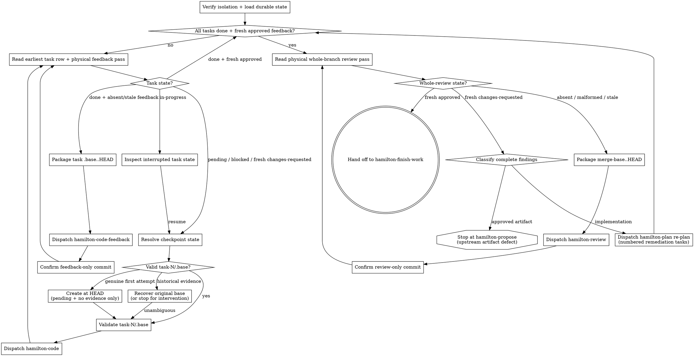

# Orchestrating a plan

Drive every active task in a `plan.md` through implementation and fresh task approval, then drive
the complete branch through its whole-branch review gate. Resume from committed artifacts and git
ancestry at every decision; conversation memory and an in-session todo list are never state.

The **seven-stage core pipeline** is Hamilton's fixed spec-driven sequence: init → propose → plan → code →
code-feedback → review → finish-work. This driver coordinates the per-task `hamilton-code` ↔
`hamilton-code-feedback` loop, then one whole-branch `hamilton-review`, followed by
`hamilton-finish-work`. Wayfinder and `hamilton-critique` are optional and remain outside the
seven-step core count.

The driver coordinates three distinct roles:

- `hamilton-code` owns one task's implementation status and task-local progress.
- `hamilton-code-feedback` judges one task's stable diff and owns its feedback artifact.
- `hamilton-review` judges the complete branch and owns the root review artifact.

**Continuous execution.** Run tasks in plan order without asking whether to continue. Stop only
for an unresolved blocker, an upstream artifact defect, unsafe workspace state, or completion of
the fresh whole-branch approval gate.

**Coordinate; never implement.** Dispatch the skills that own code, planning, and review. Do not
edit implementation, tests, `plan.md`, progress, feedback, or review artifacts in the controller.
The only controller state is its todo display, which mirrors rather than replaces durable state.

## Inputs

- A change directory at `.hamilton/changes/<YYYY-MM-DD-title>/` containing `plan.md`.
- The root `<change-dir>/progress.md` task ledger and linked
  `<change-dir>/tasks/task-N/progress.md` files.
- Task-local `<change-dir>/tasks/task-N/.base` checkpoints and `feedback.md` files when present.
- Root `<change-dir>/review.md` when present.
- The change's proposal, requirements, and design artifacts when present.
- Project standards from `AGENTS.md` or the repository equivalent.

Require the split execution layout before dispatching. Active task ids come from `plan.md`; root
rows use only `pending`, `in-progress`, `blocked`, or `done` and link to the matching lowercase
`tasks/task-N/progress.md`. Reject a planned legacy layout rather than migrating it in place.

## References

Read the scope-specific prompt that matches each dispatch:

- `references/implementer-prompt.md` dispatches `hamilton-code` for one exact Task N.
- `references/code-feedback-prompt.md` dispatches `hamilton-code-feedback` for one exact Task N.
- `references/whole-branch-review-prompt.md` dispatches `hamilton-review` for the complete branch.

Do not combine the two review scopes into a conditional prompt. Task feedback and whole-branch
review have different evidence, inspection boundaries, artifact destinations, and handoffs.

## Principles

- **Read state, then dispatch.** Before every action, recompute the applicable matrix from the
  root row, the physically last verdict, and reviewed-range freshness.
- **One active task lane.** Never dispatch task implementers in parallel. Resolve the earliest
  active task that has not reached `done` plus fresh approval before selecting another.
- **One task, one checkpoint.** Create `<change-dir>/tasks/task-N/.base` from current `HEAD` only
  before a genuine first attempt. Every later dispatch validates the historical checkpoint or
  recovers that same commit from unambiguous durable evidence; it never rebases the task range.
- **Stage-owned evidence.** Code owns the root status and task progress, code feedback owns only
  task feedback, and whole-branch review owns only root review.
- **Commit every gate.** A feedback or review verdict is not a completed checkpoint until its
  owner has made and verified the required artifact-only commit.
- **Files carry detail.** Task progress is the only detailed implementer report. Dispatch output
  is concise status and commit information; diff packages and verdict artifacts carry review
  evidence.
- **Fail closed.** An absent, malformed, unreachable, contradictory, or stale last pass never
  inherits an earlier approval.
- **Specify every model.** Every dispatch names its model according to **Model roles**.

## Checkpoint establishment and recovery

Create a new checkpoint only when every first-attempt condition holds: the root row is `pending`,
the task log has no `## Attempt` section, task feedback is absent, and the working tree and task
history show no task-owned implementation changes. Only in that state run
`~/.hamilton/scripts/hamilton-diff-package.sh --record --task N --change-dir <change-dir>` to
record current `HEAD` as the checkpoint. Confirm the resulting file contains exactly one full
commit identifier and that git resolves it.

For every other dispatch, first validate the existing checkpoint without changing it. Historical
evidence exists when the root status is anything other than `pending`, the task log contains an
`## Attempt` section, task feedback exists, or task-owned implementation work is present. A valid
checkpoint must contain one full commit identifier, resolve in the repository, and be an ancestor
of current `HEAD` and every valid recorded feedback Head. An existing checkpoint for a task with
historical evidence must also match every available recovery candidate and precede the first
implementation attempt; a commit is not valid merely because it resolves or equals current
`HEAD`.

If the checkpoint is missing or malformed after historical evidence exists, reconstruct it only
from unambiguous durable git, task, and feedback evidence. Candidate sources are every valid
feedback `Base:` value and the first parent of the earliest commit that added the first task
attempt to `tasks/task-N/progress.md`. Validate every candidate as a full commit, require every available
candidate to identify the same full commit, and require that commit to precede the first
implementation attempt and be an ancestor of every valid feedback Head and current `HEAD`. Restore
that identifier to `tasks/task-N/.base`, keep the path ignored, and validate it again before
dispatch.

Otherwise stop and request intervention. Missing candidates, conflicting candidates, ambiguous
git history, invalid ancestry, or evidence that cannot distinguish the original pre-implementation
commit is not recoverable automatically. Never record current `HEAD` when historical evidence
exists, and never continue code with an unresolved checkpoint.

## Durable task approval

An approval is consumable only when every part of this predicate succeeds for the exact
`tasks/task-N/feedback.md` path:

- the feedback path is tracked at current `HEAD`: `git ls-files --error-unmatch` succeeds for the
  exact path and the path exists in the `HEAD` tree;
- the feedback path's index entry is unchanged from current `HEAD`:
  `git diff --cached --quiet HEAD --` succeeds for the exact path;
- the feedback path's worktree content is unchanged from the index: `git diff --quiet --` succeeds
  for the exact path;
- the latest commit that touched the feedback path is artifact-only, and the commit's path list
  contains only `tasks/task-N/feedback.md`;
- the physical last pass has exact task identity and valid pass shape, says `approved`, contains no
  blocking findings, and is fresh by the task range rules below.

Evaluate this predicate from repository state, never from subagent output. Any failed condition,
including a worktree-only approval, an untracked file, or a mixed latest feedback-touching commit,
requires the driver to dispatch `hamilton-code-feedback` for the same task; it never authorizes a
later task checkpoint or whole-branch review. Evaluate the index and worktree conditions
independently: a staged feedback blob that differs while the worktree matches `HEAD` must fail the
index condition.

## Task resume matrix

Apply this matrix to the earliest active task that is not fully gated. `Feedback state` means the
physically last pass in `tasks/task-N/feedback.md`, validated against the latest commit that
touched that task's progress file.

| Root status | Feedback state | Action |
|---|---|---|
| `pending` | any | Dispatch `hamilton-code` for Task N. |
| `blocked` | any | Dispatch `hamilton-code` for Task N with the recorded blocker and newly available resolution. |
| `in-progress` | any | Inspect Task N's git state and task-local log before resuming or resolving it; never select another task. |
| `done` | absent | Dispatch `hamilton-code-feedback` for the stable Task N range. |
| `done` | feedback untracked or changed from `HEAD` | Dispatch `hamilton-code-feedback` for the stable Task N range. |
| `done` | latest feedback-touching commit is mixed | Dispatch `hamilton-code-feedback` for the stable Task N range. |
| `done` | stale or malformed | Dispatch `hamilton-code-feedback` for the stable Task N range. |
| `done` | fresh `changes-requested` with no canonical unresolved `cannot verify from diff` Blocking item | Dispatch `hamilton-code` with `tasks/task-N/feedback.md`. |
| `done` | fresh `changes-requested` with a canonical unresolved `cannot verify from diff` Blocking item | Driver adjudicates the concrete named risk before code or advancement. |
| `done` | durable, fresh `approved` with no blocking findings | Advance to the next active task or the whole-branch gate. |

A task feedback pass is fresh only when its full Base and Head are valid commits, Base is an
ancestor of Head, Head is an ancestor of current `HEAD`, and Head contains the latest commit that
touched `tasks/task-N/progress.md`. A later code attempt therefore makes every earlier pass stale,
including a prior `changes-requested` pass: the corrected task goes to code feedback, not directly
back to another correction.

An unresolved evidence item is canonical only when a finding under the physical last pass's
`### Blocking` section contains the exact text `cannot verify from diff`. Other
`changes-requested` passes are ordinary code findings and return directly to `hamilton-code`.

For `in-progress`, inspect only that task's working tree, commits, checkpoint, and physical latest
attempt. Determine whether an interrupted implementer is still running, whether its work can be
resumed by a fresh `hamilton-code` dispatch, or whether it must finish through the canonical
blocked path. Never manufacture an attempt entry or infer completion from code alone.

For `blocked`, read the latest task attempt before dispatch. Supply missing context, a resolved
external condition, or a more suitable explicitly named model. If nothing has changed, do not
repeat the same dispatch. A task too large or impossible as planned is a plan defect and stops for
re-plan or user adjudication rather than an improvised split.

## Whole-branch resume matrix

Use this matrix only after every active task is `done` with fresh `approved` feedback and no
blocking findings. `Review state` means the physically last pass in root `review.md`, validated
against the current branch and latest material change commit.

| Review state | Action |
|---|---|
| absent | Dispatch `hamilton-review` on the complete branch. |
| stale or malformed | Dispatch `hamilton-review` on the complete branch. |
| fresh `changes-requested` | Classify the complete finding set for re-plan or the upstream-defect stop. |
| fresh `approved` with no blocking findings | Hand off to `hamilton-finish-work`. |

Whole-branch freshness follows `hamilton-review`'s material-path and ancestry rules. The
physically last pass governs; never scan backward to an earlier approval. Do not rerun approved
current tasks or review merely because conversation history was compacted or lost.

## Process

1. **Verify workspace isolation.** Run
   `~/.hamilton/scripts/hamilton-isolate.sh --check --change-dir <change-dir>`. Continue only when
   its last line is `isolated: yes`. If the installed script is absent, verify that the change
   directory is under the repository root and the branch is not the default branch. Otherwise
   stop before dispatching.
2. **Load durable state.** Run
   `~/.hamilton/scripts/hamilton-change-context.sh <change-dir>`, then read `plan.md` for active
   task identity and shared constraints and root `progress.md` for current status. Validate the
   split layout. Read detailed task evidence only for the task currently being diagnosed,
   implemented, or reviewed. Determine verdicts from the physically last pass and validate their
   Base and Head rather than trusting a summary. At load, evaluate **Durable task approval** for
   every apparent approval before marking any task fully gated.
3. **Mirror the plan in the todo tool.** Create one visible entry per active task, in plan order,
   plus one trailing whole-branch review entry. Reflect root status and fresh approval, but never
   use the todo tool as a resume source.
4. **Run the pre-flight scan once.** Before the first task attempt, scan the plan for internal
   conflicts or a mandate that its own feedback gate would reject. Batch genuine conflicts for
   user adjudication. If the scan is clean, continue without pausing.
5. **Select the current task.** Apply **Task resume matrix** to active tasks in plan order. Mark
   only its todo entry active. A fully gated task stays complete; a root `done` row alone does not
   authorize advancement. Before selecting a later task and recording its checkpoint, re-evaluate
   **Durable task approval** for the immediately preceding task. On failure, route that task to
   `hamilton-code-feedback` and do not record the next task checkpoint.
6. **Resolve and validate the task checkpoint before code.** Apply **Checkpoint establishment and
   recovery**. A genuine pending first attempt with no implementation evidence may run
   `~/.hamilton/scripts/hamilton-diff-package.sh --record --task N --change-dir <change-dir>`.
   Every retry, correction, resumed task, or evidence-bearing task must validate its existing
   `<change-dir>/tasks/task-N/.base` or reconstruct the original commit unambiguously and validate
   it. Stop for intervention when recovery is ambiguous. Complete checkpoint validation before
   every code dispatch.
7. **Dispatch `hamilton-code`.** Fill `references/implementer-prompt.md` with one exact Task N,
   its root row, task log, minimal prior interfaces, and either first-attempt context or its fresh
   `changes-requested` feedback path. Do not provide a second detailed reporting destination.
   When the subagent returns, read the root row and physical latest task attempt instead of
   trusting its concise response. A `blocked` or interrupted result returns to the task matrix.
8. **Package the task diff after code reaches `done`.** Run
   `~/.hamilton/scripts/hamilton-diff-package.sh --task N --change-dir <change-dir>`. Capture the
   printed full Base and Head and scratch package path. Require Base to equal the unchanged task
   checkpoint and Head to contain the latest task progress commit.
9. **Dispatch `hamilton-code-feedback`.** Fill `references/code-feedback-prompt.md` with the exact
   task, full Base and Head, diff package, task-local progress path, feedback destination,
   verbatim task acceptance and cited constraints, and the located-evidence input. Use `none` for
   an ordinary pass. The reviewer judges only that stable task range and supplied bounded
   evidence and persists the supplied range in `tasks/task-N/feedback.md`.
10. **Confirm the feedback artifact-only commit.** Require the feedback subagent to commit only
    `tasks/task-N/feedback.md`, verify the commit's path list, and re-read the physical last pass.
    Re-evaluate **Durable task approval** immediately after the feedback handoff and complete this
    check before proceeding to **Select the next active task**. If the predicate fails, route the
    task back to `hamilton-code-feedback` rather than advancing. Apply the task matrix again: a
    durable fresh approval may advance, an ordinary fresh requested change returns to code, a
    canonical unresolved item enters bounded adjudication, and stale feedback returns to feedback.
11. **Adjudicate a bounded unresolved risk.** When a fresh `changes-requested` pass has a finding
    under `### Blocking` containing the exact text `cannot verify from diff`, inspect only its
    concrete named risk with cross-task context. For a confirmed code gap, dispatch
    `hamilton-code` with the feedback path and exact located gap. If located evidence resolves the
    concern without a code change, preserve the unresolved pass's same Base and Head, populate the
    dispatch template's located-evidence input with the exact named cross-task evidence, and
    re-dispatch `hamilton-code-feedback` against that same Base and Head. Do not create a code
    commit or move the reviewed Head for evidence-only re-feedback. Only a new physical pass that
    independently resolves the item may approve.
12. **Enter the whole-branch gate.** Before entering the whole-branch gate, re-evaluate
    **Durable task approval** for every active task. Any failed predicate routes that task to
    `hamilton-code-feedback` and prohibits whole-branch packaging. Only when all active tasks are
    fully gated may the driver apply **Whole-branch resume matrix**. For an absent, malformed, or
    stale pass, run
    `~/.hamilton/scripts/hamilton-diff-package.sh --whole-change`, then fill
    `references/whole-branch-review-prompt.md` with the actual merge base, current Head, complete
    package, approved change intent, root ledger, and linked task evidence.
13. **Confirm the review artifact-only commit.** Require `hamilton-review` to commit only root
    `review.md`, verify the commit's path list, and re-read its physical last pass. Apply the
    whole-branch matrix again rather than trusting transient output.
14. **Route whole-branch findings.** Apply **Whole-branch findings** to a fresh
    `changes-requested` pass. Remediation returns through the ordinary task loop; an upstream
    artifact defect stops the run.
15. **Hand off after fresh approval.** When the physical last whole-branch pass is valid, fresh,
    `approved`, and has no blocking findings, confirm the worktree and change directory are clean
    and hand off to `hamilton-finish-work`. Do not merge or open a pull request here.

Transient subagent output or parseable worktree text never substitutes for committed evidence and
never authorizes the driver to advance.

## Whole-branch findings

For implementation findings consistent with approved requirements and design, send the complete
finding set to `hamilton-plan` in re-plan mode. Re-plan must append one or more appropriately sized
numbered remediation tasks, initialize their root rows and task progress files, and commit its
artifacts. Each new task then runs through the ordinary `hamilton-code` and
`hamilton-code-feedback` loop. After all remediation tasks have fresh approval, repeat the
whole-branch review gate.

When any finding requires changing an approved requirement or design decision, stop and return
the affected artifacts and finding to `hamilton-propose` for revision and approval. Do not ask
re-plan or code to work around an upstream defect.

All whole-branch implementation corrections enter re-plan. Frozen completed tasks remain
unchanged, and every correction becomes a numbered active task present in `plan.md` with its own
ordinary implementation and feedback ownership.

## Durable resume

Root `progress.md` is the current implementation ledger. On start, compaction, or interruption,
read its canonical rows instead of reconstructing task status from attempt history. Task-local
progress remains append-only evidence and is opened only for the current task.

Combine each root row with the task's physical latest feedback verdict and freshness. Resolve the
latest implementation commit as the latest commit touching `tasks/task-N/progress.md`. Validate
the last pass's shape, full Base and Head, ancestry, and containment. Before every code attempt,
validate `tasks/task-N/.base` as the original pre-implementation commit. If it is missing or
malformed after historical evidence exists, apply **Checkpoint establishment and recovery**;
never replace it with the resume-time `HEAD`. A task is selectable as complete only when the row
is `done` and that last pass is fresh `approved` without blocking findings.

After every task passes, inspect root `review.md` the same way. Its physical last pass and latest
material change commit determine the whole-branch matrix. A committed earlier approval, a todo
checkmark, an agent response, or remembered conversation never overrides current physical state.

## Model roles

Specify a model on every dispatch.

- **Task implementer (`hamilton-code`):** use a fast, economical model for narrow mechanical work
  and a standard model for multi-file or integration-heavy tasks. Escalate a blocked retry only
  when greater reasoning capability addresses the recorded blocker.
- **Task feedback (`hamilton-code-feedback`):** use a standard model scaled to the task diff's
  risk. Subtle security, concurrency, or contract changes warrant the strongest suitable task
  reviewer.
- **Whole-branch review (`hamilton-review`):** use the most capable available model because this
  pass owns integration, affected-consumer, and omission analysis across the repository.
- **Remediation planning (`hamilton-plan`):** use a model capable of splitting the complete
  finding set into independently verifiable numbered tasks without changing approved intent.

## File handoffs

- **Implementation evidence:** the root Task N row supplies current status and
  `<change-dir>/tasks/task-N/progress.md` supplies the detailed physical latest attempt. There is
  no second implementer narrative artifact.
- **Task range:**
  `~/.hamilton/scripts/hamilton-diff-package.sh --task N --change-dir <change-dir>` packages the
  unchanged task-local checkpoint through current `HEAD`. Pass its printed full Base, Head, and
  scratch path to the code-feedback prompt.
- **Task verdict:** `<change-dir>/tasks/task-N/feedback.md` is append-only and is committed alone
  before the driver selects another task or dispatches a correction.
- **Whole-branch range:** `~/.hamilton/scripts/hamilton-diff-package.sh --whole-change` packages
  the actual default-branch merge base through current `HEAD`. Pass the complete package and
  approved change intent to the whole-branch prompt.
- **Whole-branch verdict:** `<change-dir>/review.md` is append-only and is committed alone before
  the driver re-plans or hands off to finish-work.
- **Constraints:** task feedback receives only the task's acceptance criteria and cited binding
  sections. Whole-branch review receives the complete approved requirements and design.

## Boundaries

- Always: verify isolation; validate split task identity and state; use the two resume matrices;
  create a checkpoint only for a genuine evidence-free first attempt; validate or unambiguously
  recover the original checkpoint before later code; name a model on every dispatch; serialize
  task work; verify each verdict's artifact-only commit; require fresh approvals before advancing.
- Ask first: starting on the default branch; a finding that conflicts with plan-mandated behavior;
  a blocker that proves the plan itself invalid and lacks an already specified re-plan path.
- Never: edit implementation, tests, plan, or stage-owned evidence in the controller; dispatch two
  implementers concurrently; infer task identity from a title; read sibling task detail without a
  concrete current-state reason; advance on root `done` alone; accept a stale or malformed pass;
  send whole-branch findings directly to code; merge or open a pull request.

## Output

Every active plan task is committed with root status `done`, canonical task progress, and a
physically last task-feedback pass that is valid, fresh, `approved`, and free of blocking findings.
The complete branch has a committed root review pass that is valid, fresh, `approved`, and free of
blocking findings. The worktree and change directory are clean, and control is handed to
`hamilton-finish-work`. If an unresolved blocker or upstream artifact defect remains, report it
plainly and stop in its owning stage.

## Process flow

```dot
digraph hamilton_orchestrate {
    "Verify isolation + load durable state" [shape=box];
    "All tasks done + fresh approved feedback?" [shape=diamond];
    "Read earliest task row + physical feedback pass" [shape=box];
    "Task state?" [shape=diamond];
    "Inspect interrupted task state" [shape=box];
    "Resolve checkpoint state" [shape=box];
    "Valid task-N/.base?" [shape=diamond];
    "Create at HEAD\n(pending + no evidence only)" [shape=box];
    "Recover original base\n(or stop for intervention)" [shape=box];
    "Validate task-N/.base" [shape=box];
    "Dispatch hamilton-code" [shape=box];
    "Package task .base..HEAD" [shape=box];
    "Dispatch hamilton-code-feedback" [shape=box];
    "Confirm feedback-only commit" [shape=box];
    "Read physical whole-branch review pass" [shape=box];
    "Whole-review state?" [shape=diamond];
    "Package merge-base..HEAD" [shape=box];
    "Dispatch hamilton-review" [shape=box];
    "Confirm review-only commit" [shape=box];
    "Classify complete findings" [shape=diamond];
    "Dispatch hamilton-plan re-plan\n(numbered remediation tasks)" [shape=box];
    "Stop at hamilton-propose\n(upstream artifact defect)" [shape=octagon];
    "Hand off to hamilton-finish-work" [shape=doublecircle];

    "Verify isolation + load durable state" -> "All tasks done + fresh approved feedback?";
    "All tasks done + fresh approved feedback?" -> "Read earliest task row + physical feedback pass" [label="no"];
    "Read earliest task row + physical feedback pass" -> "Task state?";
    "Task state?" -> "Inspect interrupted task state" [label="in-progress"];
    "Inspect interrupted task state" -> "Resolve checkpoint state" [label="resume"];
    "Task state?" -> "Resolve checkpoint state" [label="pending / blocked / fresh changes-requested"];
    "Resolve checkpoint state" -> "Valid task-N/.base?";
    "Valid task-N/.base?" -> "Validate task-N/.base" [label="yes"];
    "Valid task-N/.base?" -> "Create at HEAD\n(pending + no evidence only)" [label="genuine first attempt"];
    "Create at HEAD\n(pending + no evidence only)" -> "Validate task-N/.base";
    "Valid task-N/.base?" -> "Recover original base\n(or stop for intervention)" [label="historical evidence"];
    "Recover original base\n(or stop for intervention)" -> "Validate task-N/.base" [label="unambiguous"];
    "Validate task-N/.base" -> "Dispatch hamilton-code";
    "Dispatch hamilton-code" -> "Read earliest task row + physical feedback pass";
    "Task state?" -> "Package task .base..HEAD" [label="done + absent/stale feedback"];
    "Package task .base..HEAD" -> "Dispatch hamilton-code-feedback";
    "Dispatch hamilton-code-feedback" -> "Confirm feedback-only commit";
    "Confirm feedback-only commit" -> "Read earliest task row + physical feedback pass";
    "Task state?" -> "All tasks done + fresh approved feedback?" [label="done + fresh approved"];
    "All tasks done + fresh approved feedback?" -> "Read physical whole-branch review pass" [label="yes"];
    "Read physical whole-branch review pass" -> "Whole-review state?";
    "Whole-review state?" -> "Package merge-base..HEAD" [label="absent / malformed / stale"];
    "Package merge-base..HEAD" -> "Dispatch hamilton-review";
    "Dispatch hamilton-review" -> "Confirm review-only commit";
    "Confirm review-only commit" -> "Read physical whole-branch review pass";
    "Whole-review state?" -> "Classify complete findings" [label="fresh changes-requested"];
    "Classify complete findings" -> "Dispatch hamilton-plan re-plan\n(numbered remediation tasks)" [label="implementation"];
    "Dispatch hamilton-plan re-plan\n(numbered remediation tasks)" -> "All tasks done + fresh approved feedback?";
    "Classify complete findings" -> "Stop at hamilton-propose\n(upstream artifact defect)" [label="approved artifact"];
    "Whole-review state?" -> "Hand off to hamilton-finish-work" [label="fresh approved"];
}
```
