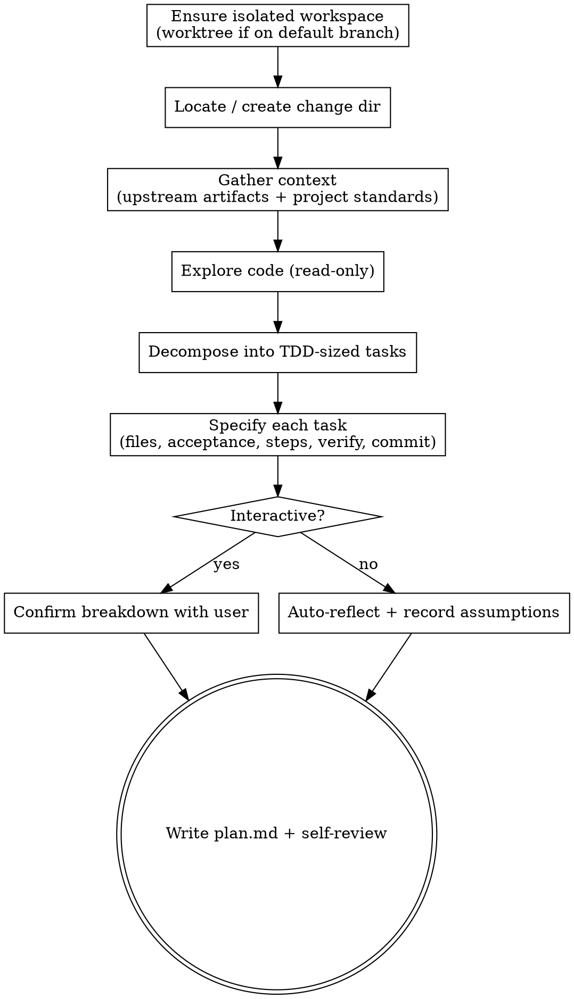

# Planning a change

Turn a change — whether it already has a design and requirements, or is just a
request — into `plan.md`: an ordered ledger of small, independently verifiable tasks that
a coder (human or agent) implements one at a time.

The **pipeline** is Hamilton's spec-driven sequence for a change: propose → plan → code →
review → finish-work. Each step is a skill that a person or an agent can run. This skill
is the **plan** step.

`plan.md` is the one required artifact in the pipeline and the handoff contract between
planning and coding. This skill produces it. **It never writes production code.**

## Inputs

- A change directory at `.hamilton/changes/<YYYY-MM-DD-title>/`. Create it if missing —
  `plan.md` always lives inside one, even when the pipeline starts at this step.
- Rich path: `design.md` and `requirements/` already exist — plan from them.
- Minimal path: only a user request. Capture the why/what in the plan's Overview and proceed.
- Project standards: `AGENTS.md`, for test/build commands, project structure, code style,
  and boundaries. Read it — do not guess conventions.

## Principles

- **Plan-first, read-only.** Explore the code you will touch before writing the plan.
  Understand existing patterns and how tests run. Make no edits in this step.
- **TDD-sized tasks.** Each task is small enough to implement and verify in isolation —
  about one red→green→refactor loop. "Build authentication" is too big; "add a
  registration endpoint that validates email format" is right.
- **One task at a time.** The coder consumes a single task and nothing else, so each task
  must be self-contained: its files, acceptance, and verification stand alone.
- **Steps are executed verbatim.** The coder follows a task's Steps exactly and adds no
  design of its own (it may be a weak model). Make the steps explicit, ordered, and
  test-first where behavior is testable — all the sequencing thinking happens here, not at
  code time.
- **Reference, don't copy.** Point to `design.md` / `requirements/`; do not duplicate them.
- **Detail scales to risk.** Include code or exact commands only where they remove
  ambiguity. Otherwise state intent and let the coder think — do not pre-write the diff.

## Process

1. **Ensure an isolated workspace.** Detect isolation first: if you are already in a linked
   worktree (`git rev-parse --git-dir` differs from `--git-common-dir`, and you are not in a
   submodule) or on a dedicated branch (not the repo's default branch), work in place.
   Otherwise derive a kebab-case title from the change (its existing directory name, or from
   the request on the minimal path) and create a worktree on a new branch, both named for the
   change, under the git-ignored `.worktrees/` directory —
   `git worktree add .worktrees/<title> -b <title>` — then switch into it before doing anything
   else.
2. **Locate the change.** Find or create `.hamilton/changes/<YYYY-MM-DD-title>/`.
3. **Gather context.** Read upstream artifacts if present (proposal, design, requirements)
   and the project standards (commands, structure, style, boundaries). On the minimal
   path, write a two-line why/what for the Overview.
4. **Explore (read-only).** Map the files and modules involved, the patterns to follow,
   and the test setup. Make no edits.
5. **Decompose.** Break the work into TDD-sized tasks. Order them and mark dependencies so
   independent tasks can run in parallel. Prefer more small tasks over few large ones.
6. **Specify each task.** For every task capture: files (created / modified / deleted),
   acceptance criteria (testable; cite the requirement scenario when one exists), steps
   (write failing test → implement → verify), a verify command with its expected result,
   and a commit message.
7. **Confirm or auto-reflect.** If working with a person, present the task breakdown and
   confirm it before finalizing. If running unattended, self-review against the checklist
   below and record any assumptions inline in the plan.
8. **Write `plan.md`** from `~/.hamilton/templates/plan.md` (installed by `hamilton setup`)
   into the change directory.

## Task-sizing heuristics

- Implementable and testable in isolation — one red-green loop.
- If a task needs more than one independent test to prove it, consider splitting it.
- A task whose title contains "and" is often two tasks.

## Self-review

Before finishing, confirm:

- Every task is independently verifiable, with a concrete verify command.
- Each task's Steps are explicit enough to follow with no further design.
- Each Files list is complete (created / modified / deleted).
- Each acceptance criterion ties to a requirement scenario where one exists.
- Dependencies are correct and acyclic.
- "Done when" captures: all tasks done, tests green, reviews addressed.

## Output

`.hamilton/changes/<change>/plan.md`, following `~/.hamilton/templates/plan.md`.

## Process flow

