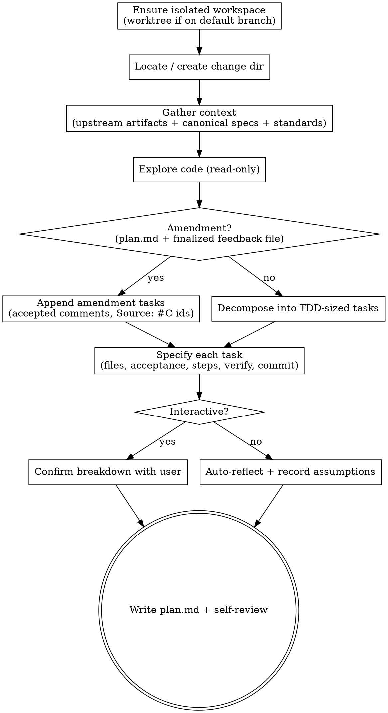

# Planning a change

Turn a change — whether it already has a design and requirements, or is just a
request — into `plan.md`: an ordered ledger of small, independently verifiable tasks that
a coder (human or agent) implements one at a time.

The **pipeline** is Hamilton's spec-driven sequence for a change: propose → plan → code →
review → finish-work. Each step is a skill that a person or an agent can run. This skill
is the **plan** step.

`plan.md` is the one required artifact in the pipeline and the handoff contract between
planning and coding. This skill produces it. **It never writes production code.**

## Inputs

- A change directory at `.hamilton/changes/<YYYY-MM-DD-title>/`. Create it if missing —
  `plan.md` always lives inside one, even when the pipeline starts at this step.
- Rich path: `design.md` and `requirements/` already exist — plan from them.
- Minimal path: only a user request. Capture the why/what in the plan's Overview and proceed.
- Amendment path: `plan.md` already exists and the input is a finalized feedback file
  (`feedback/<YYYY>-<MM>-<DD>-<index>.md`, from `hamilton-feedback`). Append tasks for the
  accepted comments; do not rewrite the plan. See **Amendment path** below.
- Project standards: `AGENTS.md`, for test/build commands, project structure, code style,
  and boundaries. Read it — do not guess conventions.
- The project's canonical specs (`.hamilton/specs/`): the current, consolidated requirement
  truth for each capability. Read the specs the change touches so the plan stays consistent
  with established behavior and prior decisions — especially on the minimal path, where no
  per-change `requirements/` exists and the specs are your only view of existing behavior.

## References

This skill ships with a `references/` folder. Read reference files using the Read tool on
the skill's own directory — they are co-located with this SKILL.md, **not** at
`~/.hamilton/` or `~/.hamilton/templates/`.

- `references/code-quality.md` — the self-review rubric for plan quality.

## Principles

- **Plan-first, read-only.** Explore the code you will touch before writing the plan.
  Understand existing patterns and how tests run. Make no edits in this step.
- **TDD-sized tasks.** Each task is small enough to implement and verify in isolation —
  about one red→green→refactor loop. "Build authentication" is too big; "add a
  registration endpoint that validates email format" is right.
- **One task at a time.** The coder consumes a single task and nothing else, so each task
  must be self-contained: its files, acceptance, and verification stand alone.
- **Steps are executed verbatim.** The coder follows a task's Steps exactly and adds no
  design of its own (it may be a weak model). Make the steps explicit, ordered, and
  test-first where behavior is testable — all the sequencing thinking happens here, not at
  code time.
- **Reference, don't copy.** Point to `design.md` / `requirements/`; do not duplicate them.
- **Honor the canonical specs.** Before decomposing, read the `.hamilton/specs/` entries for
  the capabilities the change touches. They record the conventions and decisions the project
  has already committed to; a plan that quietly contradicts them regresses agreed behavior.
  Follow them, or surface the conflict — do not plan around it silently.
- **Plan for quality.** The coder executes verbatim and adds no design, so the plan carries
  the quality — not the code step. Decompose so each task preserves the design's structure
  and stays independently testable, and make any code snippet model the clean shape rather
  than a shortcut the coder will copy. Judge the plan against `references/code-quality.md`
  (read it from this skill's references directory), proportional to the change's size.
- **Detail scales to risk.** Include code or exact commands only where they remove
  ambiguity. Otherwise state intent and let the coder think — do not pre-write the diff.
- **Write flowing prose.** In `plan.md` — overviews, task descriptions, acceptance
  criteria, and every other narrative field — let paragraphs run as continuous lines. Do
  not hard-wrap text at ~80 characters or any fixed width; insert a line break only at a
  real boundary (between paragraphs, list items, or headings). Code blocks and commands
  keep their own formatting; soft-wrapping prose is the reader's job, not yours.

## Process

1. **Ensure an isolated workspace — then confirm you are inside it.** Detect isolation first:
   if you are already in a linked worktree (`git rev-parse --git-dir` differs from
   `--git-common-dir`, and you are not in a submodule) or on a dedicated branch (not the repo's
   default branch), work in place. Otherwise derive a kebab-case title from the change (its
   existing directory name, or from the request on the minimal path) and create a worktree on a
   new branch, both named for the change, under the git-ignored `.worktrees/` directory:

   ```bash
   git worktree add .worktrees/<title> -b <title>
   cd .worktrees/<title>
   git rev-parse --show-toplevel   # MUST print the .worktrees/<title> path
   ```

   Creating the worktree does **not** move you into it — a fresh `git worktree add` leaves your
   shell and every file tool rooted in the original checkout. You must `cd` into the worktree
   and then **verify the switch took effect** before doing anything else: run
   `git rev-parse --show-toplevel` and confirm the output ends in `.worktrees/<title>`. **Do not
   proceed to step 2 until it does.** If you skip this check you will silently plan and write on
   the default branch — the exact failure this step exists to prevent.

   From here on, every path in this skill is relative to that worktree root: the change directory,
   all code you explore, and `plan.md` are created **inside** `.worktrees/<title>/`, never in the
   original checkout. When in doubt, use the absolute worktree path returned by
   `git rev-parse --show-toplevel` as the base for file operations.
   On the **amendment path** the change is already on its own branch — the one the request was
   opened from — so isolation is satisfied: work in place, and never create a second worktree
   for a change that already has one.
2. **Locate the change.** Find or create `.hamilton/changes/<YYYY-MM-DD-title>/`. On the
   amendment path the directory already exists — use it; never open a second one for the same
   change.
3. **Gather context.** Read upstream artifacts if present (proposal, design, requirements),
   the canonical specs (`.hamilton/specs/`) for the capabilities the change touches, and the
   project standards (commands, structure, style, boundaries). The specs carry the conventions
   and decisions already committed for those capabilities — follow them so the plan stays
   consistent. On the minimal path, where no per-change `requirements/` exists, the specs are
   your primary source of existing behavior; write a two-line why/what for the Overview.
4. **Explore (read-only).** Map the files and modules involved, the patterns to follow,
   and the test setup. Make no edits.
5. **Decompose.** Break the work into TDD-sized tasks. Order them and mark dependencies so
   independent tasks can run in parallel. Prefer more small tasks over few large ones. Cut
   the seams along the design's boundaries so each task lands one cohesive unit — a task you
   cannot describe without "and" is usually two.
6. **Specify each task.** For every task capture: files (created / modified / deleted),
   acceptance criteria (testable; cite the requirement scenario when one exists — and cover
   the error/edge behavior, not just the happy path), steps (write failing test → implement
   → verify), a verify command with its expected result, and a commit message. Where a step
   includes a code snippet, make it model the clean shape from `references/code-quality.md`;
   the coder copies it verbatim.
7. **Confirm or auto-reflect.** If working with a person, present the task breakdown and
   confirm it before finalizing. If running unattended, self-review against the checklist
   below and record any assumptions inline in the plan.
8. **Write `plan.md`** from `~/.hamilton/templates/plan.md` (installed by `hamilton setup`)
   into the change directory. On the amendment path, append to the existing `plan.md` instead
   — see below.

## Task-sizing heuristics

- Implementable and testable in isolation — one red-green loop.
- If a task needs more than one independent test to prove it, consider splitting it.
- A task whose title contains "and" is often two tasks.

## Amendment path

A change that has already been implemented and reviewed externally comes back here with a
finalized `feedback/<YYYY>-<MM>-<DD>-<index>.md`. The completed tasks in `plan.md` are the
record of what was built and why — they are history. Do not rewrite, renumber, or delete
them.

- **Read the feedback file first,** and take only the comments marked `accepted`. `rejected`,
  `deferred`, and `no-action` carry no work; a comment whose Artifact impact is `design` or
  `requirements` should already have gone through `hamilton-propose` before reaching you, so
  plan from the revised artifacts, not from the comment.
- **Append one section,** headed `## Tasks — amendment: feedback/<YYYY>-<MM>-<DD>-<index>.md`,
  below the existing tasks. Continue the task numbering from the last existing task; a second
  amendment pass appends its own section below the first.
- **Cite the comments each task resolves** in the task's `Source:` field
  (`feedback/<file>#C3, #C7`). One task may resolve several comments when they share a root
  cause — that is the point of the root-cause pass — and one comment may need several tasks.
  Every accepted comment must appear in at least one task's `Source:`.
- **Size and specify them like any other task:** files, acceptance criteria, test-first steps,
  a verify command, a commit message. An amendment task is not exempt from TDD sizing because
  it came from a reviewer.
- **Fix the cause, not the comment.** Where the assessment found a root cause broader than
  what the reviewer noticed, plan the fix at the cause and note the surface symptoms it
  clears. Do not plan a per-comment patch that leaves the cause in place.
- **Do not re-plan untouched work.** Tasks the review did not challenge stay as they are.

## Self-review

Before finishing, confirm:

- You are inside the intended worktree, not the default branch: `git rev-parse --show-toplevel`
  ends in `.worktrees/<title>` (or you were legitimately working in place per step 1), and
  `plan.md` was written under that root.
- Every task is independently verifiable, with a concrete verify command.
- Each task's Steps are explicit enough to follow with no further design.
- Each Files list is complete (created / modified / deleted).
- Each acceptance criterion ties to a requirement scenario where one exists.
- Dependencies are correct and acyclic.
- The task seams follow the design's boundaries; no task bundles unrelated changes, and each
  lands a unit that can be tested in isolation (`references/code-quality.md`, proportional to
  the change).
- Any code snippet in a task models the clean shape — the coder copies it verbatim.
- "Done when" captures: all tasks done, tests green, reviews addressed.
- On the amendment path: every `accepted` comment in the feedback file appears in some task's
  `Source:`; no existing task was rewritten, renumbered, or deleted; no `rejected` or
  `deferred` comment produced work.

**Blocking.** For a non-trivial change — one that adds or restructures units, not a mechanical
or single-file edit — do not finalize `plan.md` while a task carries an unresolved structural
smell (bundles unrelated changes, cannot be tested in isolation, or embeds a snippet with a
shortcut the coder will copy). Re-slice the tasks, or record a deliberate exception in the
plan's **Quality notes** (Overview). The coder adds no design of its own, so a smell left in
the plan ships to the code.

## Output

`.hamilton/changes/<change>/plan.md`, following `~/.hamilton/templates/plan.md`.

## Handoff

Close by orienting the user, not by silently stopping.

- **Disclose the workspace.** If step 1 created a worktree for this change, state its path
  (`.worktrees/<title>`) and branch — `plan.md`, and all the code to come, live there, not in
  the original checkout. If you were already isolated and worked in place, name that branch.
- **Name the next step.** `plan.md` is the handoff contract; what follows is `hamilton-code`
  (one task at a time) or `hamilton-orchestrate` (the whole plan in one session).
- **Hand back the decision.** Working with a person, ask whether to proceed to implementation
  rather than declaring you are "ready" — and never invoke the next skill yourself. Running
  unattended, name the next step and return without asking; the driver owns the loop.

## Process flow


```dot
digraph hamilton_plan {
    "Ensure isolated workspace\n(worktree if on default branch)" [shape=box];
    "Locate / create change dir" [shape=box];
    "Gather context\n(upstream artifacts + canonical specs + standards)" [shape=box];
    "Explore code (read-only)" [shape=box];
    "Amendment?\n(plan.md + finalized feedback file)" [shape=diamond];
    "Append amendment tasks\n(accepted comments, Source: #C ids)" [shape=box];
    "Decompose into TDD-sized tasks" [shape=box];
    "Specify each task\n(files, acceptance, steps, verify, commit)" [shape=box];
    "Interactive?" [shape=diamond];
    "Confirm breakdown with user" [shape=box];
    "Auto-reflect + record assumptions" [shape=box];
    "Write plan.md + self-review" [shape=doublecircle];

    "Ensure isolated workspace\n(worktree if on default branch)" -> "Locate / create change dir";
    "Locate / create change dir" -> "Gather context\n(upstream artifacts + canonical specs + standards)";
    "Gather context\n(upstream artifacts + canonical specs + standards)" -> "Explore code (read-only)";
    "Explore code (read-only)" -> "Amendment?\n(plan.md + finalized feedback file)";
    "Amendment?\n(plan.md + finalized feedback file)" -> "Append amendment tasks\n(accepted comments, Source: #C ids)" [label="yes"];
    "Amendment?\n(plan.md + finalized feedback file)" -> "Decompose into TDD-sized tasks" [label="no"];
    "Append amendment tasks\n(accepted comments, Source: #C ids)" -> "Specify each task\n(files, acceptance, steps, verify, commit)";
    "Decompose into TDD-sized tasks" -> "Specify each task\n(files, acceptance, steps, verify, commit)";
    "Specify each task\n(files, acceptance, steps, verify, commit)" -> "Interactive?";
    "Interactive?" -> "Confirm breakdown with user" [label="yes"];
    "Interactive?" -> "Auto-reflect + record assumptions" [label="no"];
    "Confirm breakdown with user" -> "Write plan.md + self-review";
    "Auto-reflect + record assumptions" -> "Write plan.md + self-review";
}
```
