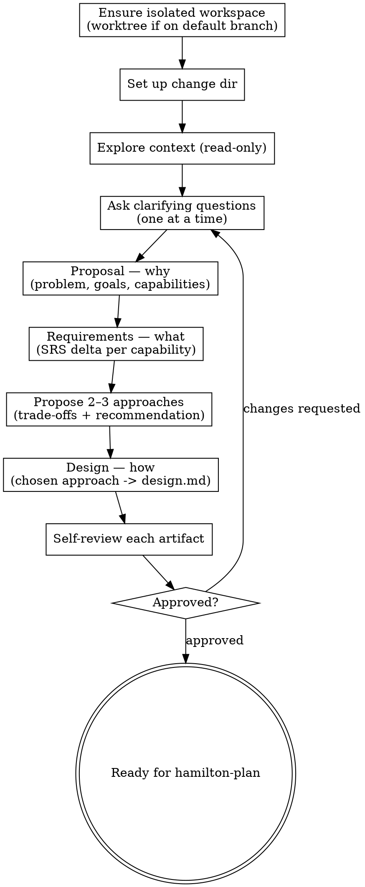

# Proposing a change

Turn an idea into a well-formed change by writing its proposal (why), requirements (what),
and design (how) — refined with the user through dialogue before any implementation begins.

The **pipeline** is Hamilton's spec-driven sequence for a change: propose → plan → code →
review → finish-work. Each step is a skill a person or an agent can run. This skill is
**step 1** — the optional heavyweight front door that produces the PRD, the SRS, and the
SDD. A change that does not warrant that depth skips this step and starts at `hamilton-plan`.

**Gate.** Do not move to implementation — no `hamilton-plan`, no code — until the artifacts
are approved and the design clears the `references/code-quality.md` self-review: for a
non-trivial change, an unresolved structural smell blocks the gate (see step 9).

## What it produces

In `.hamilton/changes/<YYYY-MM-DD-title>/`, using the templates at `~/.hamilton/templates/`:

- `proposal.md` — the PRD: why, what changes, and the capabilities affected.
- `requirements/<capability>.md` — the SRS (delta form) for each capability.
- `design.md` — the SDD: how it will be built.

## Inputs

- A change idea or request. If none is given, ask what to build.
- The project's canonical specs (`.hamilton/specs/`) — the current requirement truth for each
  capability. Read them to tell new capabilities from modified ones, and to keep the proposal
  and requirements consistent with the conventions and decisions already committed.
- Project standards (`AGENTS.md`).

## References

This skill ships with a `references/` folder. Read reference files using the Read tool on
the skill's own directory — they are co-located with this SKILL.md, **not** at
`~/.hamilton/` or `~/.hamilton/templates/`.

- `references/code-quality.md` — the self-review rubric for design quality.

## Principles

- **Collaborate.** Refine through dialogue — ask one question at a time, prefer
  multiple-choice, and confirm each section before moving on.
- **High-level first.** Start from the user's goal; draft, then elaborate together.
- **YAGNI.** Cut unnecessary scope from every artifact.
- **Explore alternatives.** Offer 2–3 approaches with trade-offs and a recommendation
  before settling on a design.
- **Design for quality.** Code quality is decided here, not at review. The decomposition,
  boundaries, and dependencies the design commits to are inherited by every line the coder
  later writes — and a defect caught at review means refactoring code that already exists.
  Judge the design against `references/code-quality.md` (read it from this skill's
  references directory), proportional to the change's size.
- **Right-size.** Scale each artifact to the change; a few sentences is fine when the
  change is simple.
- **Write flowing prose.** In every artifact you produce (`proposal.md`, `requirements/`,
  `design.md`), let paragraphs run as continuous lines — do not hard-wrap text at ~80
  characters or any fixed width. Insert a line break only at a real boundary: between
  paragraphs, list items, or headings. Soft-wrapping is the reader's job, not yours.

## Process

1. **Derive the title, ensure an isolated workspace — then confirm you are inside it.** Derive a
   kebab-case title from the request. Then detect isolation: if you are already in a linked
   worktree (`git rev-parse --git-dir` differs from `--git-common-dir`, and you are not in a
   submodule) or on a dedicated branch (not the repo's default branch), work in place. Otherwise
   create a worktree on a new branch, both named for the change, under the git-ignored
   `.worktrees/` directory:

   ```bash
   git worktree add .worktrees/<title> -b <title>
   cd .worktrees/<title>
   git rev-parse --show-toplevel   # MUST print the .worktrees/<title> path
   ```

   Creating the worktree does **not** move you into it — a fresh `git worktree add` leaves your
   shell and every file tool rooted in the original checkout. You must `cd` into the worktree and
   then **verify the switch took effect** before creating any files: run
   `git rev-parse --show-toplevel` and confirm the output ends in `.worktrees/<title>`. **Do not
   proceed to step 2 until it does.** If you skip this check you will silently write every
   artifact on the default branch — the exact failure this step exists to prevent. From here on,
   the change directory and every artifact are created **inside** `.worktrees/<title>/`, never in
   the original checkout.
2. **Set up the change.** Create `.hamilton/changes/<YYYY-MM-DD-title>/`.
3. **Explore context (read-only).** Project structure, docs, recent commits, and the canonical
   specs (`.hamilton/specs/`). Read the specs before drafting: they hold the conventions and
   prior decisions the change inherits, so a MODIFIED capability builds on its existing
   requirement block rather than contradicting it. If the request spans several independent
   subsystems, stop and help decompose it first — one change per spec.
4. **Ask clarifying questions.** Draw out purpose, constraints, and success criteria — one
   question at a time, multiple-choice when you can. Direct them at the requester (a person,
   or the calling agent). When no one can answer, make the reasonable choice and record it
   as an assumption. Do not start drafting until the intent is clear.
5. **Write the proposal (why).** Draft `proposal.md`: problem, goals/non-goals, what
   changes, and the Capabilities list (new vs modified — check `.hamilton/specs/` for
   existing names). The Capabilities list is the contract into the requirements.

   **Right-size the capabilities — coarse, durable domains, not per-aspect shards.** Each
   capability becomes one `requirements/<capability>.md` and, downstream, one spec file, so
   over-splitting here multiplies files through the whole pipeline. A capability is a
   coherent area of behavior a reader would recognize as a top-level concern of the system —
   not a mechanism, a config surface, an integration point, a single module, or a wiring/
   startup step. Aim for the fewest capabilities that cover the change without overlap. You
   have over-split when names are adjective+noun sub-aspects of one domain
   (`structured-logging`, `distributed-tracing` are both just logging/tracing), name a single
   file or bootstrap step (`server-startup`), or describe a detail shared by two others
   (`trace-log-correlation` folds into logging + tracing). Prefer the durable domain noun and
   let its requirement cover the aspects.

   | Over-split (bad) | Right-sized (good) |
   |------------------|--------------------|
   | `application-metrics.md`, `distributed-tracing.md`, `structured-logging.md`, `trace-log-correlation.md`, `http-clients.md`, `aws-config.md`, `server-startup.md` | `metrics.md`, `tracing.md`, `logging.md`, `http-client.md`, `aws.md` |
   | `login-endpoint.md`, `password-reset.md`, `jwt-refresh.md`, `oauth-google.md`, `oauth-github.md`, `role-check-middleware.md` | `authentication.md`, `authorization.md` |
   | `stripe-integration.md`, `payment-webhooks.md`, `refund-processing.md`, `invoice-generation.md`, `dunning-emails.md` | `payments.md`, `billing.md` |
6. **Write the requirements (what).** For each capability named in the proposal, write
   `requirements/<capability>.md` in delta form (ADDED / MODIFIED / REMOVED / RENAMED), with
   normative SHALL statements and WHEN/THEN scenarios. For MODIFIED, copy the entire existing
   requirement block from the spec and edit it.
7. **Propose 2–3 approaches.** Before designing, lay out two or three ways to build it with
   their trade-offs. Lead with your recommendation and why, and get the requester's choice
   (or, unattended, pick the recommended one and record the reasoning).
8. **Write the design (how).** From the chosen approach, write `design.md`: context,
   decisions (with the alternatives considered), architecture, testing strategy, risks, and
   any change-specific boundaries. As you shape the architecture and components, apply
   `references/code-quality.md` (read from this skill's references directory) — cohesive
   units with one reason to change, narrow boundaries, inverted dependencies with named
   testable seams — sized to the change, not gold-plated. Capture the outcome in the
   design's **Quality Lens** subsection (one line for a trivial change).
9. **Self-review each artifact.** First confirm the workspace: `git rev-parse --show-toplevel`
   ends in `.worktrees/<title>` (or you were legitimately working in place per step 1) and every
   artifact was written under that root, not the default checkout. Then scan for placeholders,
   contradictions, scope creep, and ambiguity; fix in place. Then run `design.md` against
   `references/code-quality.md`.
   **Blocking:** for a non-trivial change — one that adds or restructures units, not a
   mechanical or single-file edit — an unresolved structural smell (a unit with more than one
   reason to change, a leaked boundary, a hard-wired dependency with no testable seam) is a
   gate failure. Fix the structure, or, if you are deliberately accepting it, record it in
   the design's **Quality Lens** subsection (and cross-list under Risks / Trade-offs). Do
   not pass the gate with a silent smell — a weak coder cannot recover quality the design
   did not encode.
10. **Get approval.** Present the artifacts for review; revise and re-review affected
   artifacts on request. Running unattended, record open questions. Do not pass the gate
   until approved.

## Output

`proposal.md`, `requirements/<capability>.md`, and `design.md` in the change directory —
reviewed and approved, ready for `hamilton-plan`.

## Handoff

- **Disclose the workspace.** If step 1 created a worktree for this change, state its path
  (`.worktrees/<title>`) and branch — the artifacts, and all the work to come, live there, not
  in the original checkout. If you worked in place, name that branch.
- **Name the next step.** With the artifacts approved (step 10), what follows is `hamilton-plan`.
- **Hand back the decision.** The step-10 gate already requires approval before proceeding:
  ask whether to move on to `hamilton-plan` rather than declaring readiness, and never invoke
  it yourself. Running unattended, record open questions, name the next step, and return.

## Process flow


