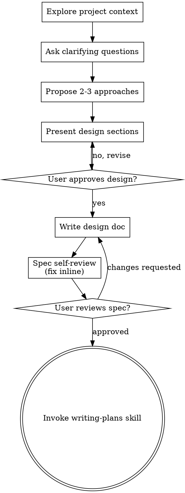

# Brainstorming Ideas Into Designs

Help turn ideas into fully formed proposals and designs through natural collaborative dialogue.

Start by understanding the current project context, then ask questions one at a time to refine the idea. Once you understand what you're building, present the design and get user approval.

Once the user approves, I'll create a change with artifacts:
- proposal.md (what & why)
- design.md (how)

<HARD_GATE>
Do NOT invoke any implementation skill, write any code, scaffold any project, or take any implementation action until you have presented a design and the user has approved it. This applies to EVERY project regardless of perceived simplicity.
</HARD_GATE>

## Input

The user's request should include a change name (kebab-case) OR a description of what they want to build.

## Anti-Pattern: "This Is Too Simple To Need A Design"

Every project goes through this process. A todo list, a single-function utility, a config change — all of them. "Simple" projects are where unexamined assumptions cause the most wasted work. The design can be short (a few sentences for truly simple projects), but you MUST present it and get approval.

## Checklist

You MUST create a task for each of these items and complete them in order:

1. **Setup change** - define change name and create change folder
2. **Explore project context** — check files, docs, recent commits
3. **Create the proposal** - write the proposal document outlining the change
4. **Create the requeriments** - Detailed requeriment specification for the change
5. **Create the design** - write a technical design document with implementation details

2. **Ask clarifying questions** — one at a time, understand purpose/constraints/success criteria
3. **Propose 2-3 approaches** — with trade-offs and your recommendation
4. **Present design** — in sections scaled to their complexity, get user approval after each section
5. **Write design doc** — save to `.hamilton/changes/<change-name>/proposal.md` and commit
6. **Spec self-review** — quick inline check for placeholders, contradictions, ambiguity, scope (see below)
7. **User reviews written spec** — ask user to review the spec file before proceeding
8. **Transition to implementation** — invoke writing-plans skill to create implementation plan

## Process Flow

## The Process

**Setup change:**
- From their description, derive a kebab-case name (e.g., "add user authentication" → `add-user-auth` or "implement-auth" → `implement-auth`)
- If no clear input provided, ask what they want to build
- Create the change directory  in the path `.hamilton/changes/<change-name>/`

**Explore project context:**
- Explore the current structure before proposing changes. Follow existing patterns.
- Where existing code has problems that affect the work (e.g., a file that's grown too large, unclear boundaries, tangled responsibilities), include targeted improvements as part of the design - the way a good developer improves code they're working in.
- Don't propose unrelated refactoring. Stay focused on what serves the current goal.

**Create the proposal:**

Read [references/proposal.md] for detailed instruction on how to create the proposal document.

**Create the requeriments:**
Read [references/requeriments.md] for detailed instruction on how to create the requeriments documents.

**Create the design:**

Read [references/design.md] for detailed instruction on how to create the design document.

## Key Principles

- **One question at a time** - Don't overwhelm with multiple questions
- **Multiple choice preferred** - Easier to answer than open-ended when possible
- **YAGNI ruthlessly** - Remove unnecessary features from all designs
- **Explore alternatives** - Always propose 2-3 approaches before settling
- **Incremental validation** - Present design, get approval before moving on
- **Be flexible** - Go back and clarify when something doesn't make sense
