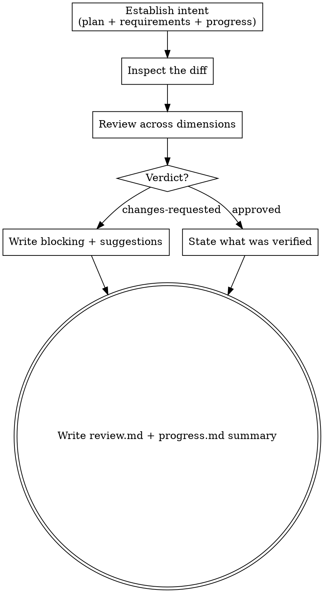

# Reviewing a change

Review the code produced for a change and return a clear verdict with feedback precise
enough that a coder can act on it without guessing.

The **pipeline** is Hamilton's spec-driven sequence for a change: propose → plan → code →
review → finish-work. Each step is a skill a person or an agent can run. This skill is the
**review** step — the pipeline's quality gate.

**Judge, don't fix.** You produce a verdict and feedback. You never modify code or
`plan.md`. When you request changes, the coder (the code step) addresses them and the work
comes back to you — that loop is driven by whoever runs the pipeline, not by this skill.

## Inputs

- The change directory path (`.hamilton/changes/<change>/`).
- The changes to review: the diff under review — a task's commit(s), or the change's full
  diff against its base branch.
- `plan.md` for what was intended, and, if present, `design.md` / `requirements/` for the
  acceptance criteria and the decisions the change committed to.
- `progress.md` for what the coder reported — especially any deviations or notes flagged
  for review.
- Project standards (`AGENTS.md`): idioms, code style, security expectations, boundaries.

## Principles

- **Evidence over claims.** Trust the diff and the tests, not the description. "It works"
  means nothing; a passing, meaningful test means something.
- **Specific and located.** Every issue names a file and place, says what is wrong and what
  to change, and cites the criterion or standard it violates. "The test asserts on the
  wrong field" is useful; "tests are weak" is not.
- **Proportionate.** Separate blocking issues (must fix before merge) from suggestions
  (optional improvements). Don't nitpick style the project doesn't enforce.
- **Scope-aware.** Flag changes outside the task's stated scope, stubs, dead code, and
  leftover TODOs.

## Process

1. **Establish intent.** Read `plan.md` (and cited `design.md` / `requirements/`) for what
   the work was meant to do and its acceptance criteria. Read `progress.md` for what the
   coder did and any flagged deviations.
2. **Inspect the diff.** Read the changes under review in full.
3. **Review across dimensions** (checklist below).
4. **Decide a verdict:** `approved` or `changes-requested`.
5. **Write feedback** in the format below — actionable, located, tagged blocking vs
   suggestion, each citing the criterion or standard it references.
6. **Record.** Write the verdict and feedback to `review.md` in the change directory
   (format below), and append a one-line summary to `progress.md`. `review.md` is what the
   coder consumes on the next pass.

## Review dimensions

- **Correctness:** Does the code satisfy every acceptance criterion / requirement scenario?
  Are edge cases and failure paths handled, not just the happy path?
- **Tests:** Do they assert real behavior and cover the criteria? Would they fail if the
  code regressed? No tests deleted or weakened to make the suite pass.
- **Security:** No secrets committed; inputs validated; no injection or unsafe handling; no
  sensitive files in the diff.
- **Idioms & standards:** Naming, structure, error handling, and style match the codebase
  and `AGENTS.md`.
- **Scope & hygiene:** Change is confined to the task; no stubs, dead code, debug output,
  commented-out blocks, or unrelated edits.
- **Boundaries:** Nothing the design marked off-limits was touched.

## Review file

Write the verdict and feedback to `.hamilton/changes/<change>/review.md`, newest pass at
the bottom:

```
## <scope reviewed> — <YYYY-MM-DD>

Verdict: approved | changes-requested

### Blocking
- [<file>:<loc>] <what is wrong> — <what to change>  (violates: <criterion / standard>)

### Suggestions
- [<file>:<loc>] <optional improvement>
```

When approved, replace the lists with a short note of what you verified.

## Progress entry

Append a one-line summary to `.hamilton/changes/<change>/progress.md`:

```
## Review: <scope reviewed> — <YYYY-MM-DD>
- Verdict: approved | changes-requested (blocking: <n>, suggestions: <n>) — see review.md
```

## Output

`review.md` written with the verdict and feedback, and a one-line summary appended to
`progress.md`. This skill does not modify code or `plan.md`.

## Process flow


