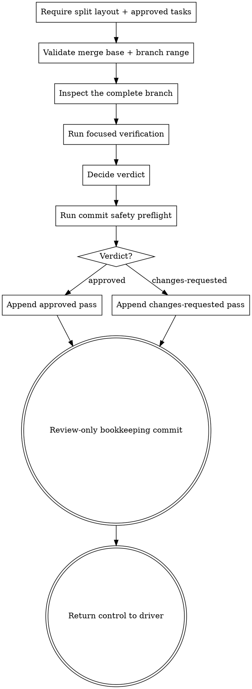

# Reviewing the whole branch

Review the complete branch as the final inspection gate before finish-work. This skill is pipeline
step 5. It judges how all implemented tasks compose across the repository; it is never a task-diff
review.

The **seven-stage core pipeline** is Hamilton's fixed spec-driven sequence: init → propose → plan → code →
code-feedback → review → finish-work. Wayfinder and `hamilton-critique` are optional and remain
outside the seven-step core count.

**Judge, do not fix.** Inspect and report. Never modify implementation, tests, proposal artifacts,
the plan, or task state while performing whole-branch review.

## Inputs

Every invocation supplies only the complete branch change from its merge base through current
`HEAD` and a whole-branch evidence package containing:

- The full merge base and head commit identifiers.
- The target branch reference, or enough repository context to resolve its default branch.
- The change directory path.
- The change-level proposal, requirements, design, plan, and root task ledger that exist.
- Every active task's latest implementation attempt and feedback concerns. Older attempts or
  feedback passes may be opened only when the latest evidence identifies a concrete historical
  question.
- The complete branch diff from the supplied merge base through the supplied head.
- Project standards from `AGENTS.md` or its repository equivalent.

The supplied base and head define one stable review range. Require both identifiers in full.
Resolve the target branch from the package, or resolve the repository's default branch when the
package does not name one. Compute the actual merge base with `git merge-base` against that target
branch and current `HEAD`; the supplied base must equal the actual merge base exactly. Merely being
an ancestor of the head is insufficient. Also require the head to be an ancestor of current `HEAD`
before inspection. Stop if the target cannot be resolved or any range check fails.

## References

This skill ships with its own `references/code-quality.md`. Read it from this skill directory and
apply its integration, omission, and affected-consumer rubric to the whole branch.

## Generation preflight

Run this no-write gate before whole-branch scope inspection, range validation, or verdict mutation.
A change directory with no `plan.md` is `pre-plan`, not legacy; stop because no planned branch can
enter final review, but do not classify or scaffold it as an unsupported generation.

Once `plan.md` exists, require the exact split root task ledger and every required active-task
scaffold artifact. Root `<change-dir>/progress.md` must be the exact task-only table, with one
`Task | Status | Progress` column set, exactly one plan-ordered row per active task, a status from
`pending`, `in-progress`, `blocked`, or `done`, and the exact `tasks/task-N/progress.md` link. Each
linked
`<change-dir>/tasks/task-N/progress.md` must exist with matching numeric task identity. Reject a
monolithic root progress file, missing scaffold, partially scaffolded or otherwise partially split
layout, alternate task path, or mixed execution and verdict history as `legacy-unsupported`. Stop
with between-changes upgrade guidance: finish the old change under its old installation or upgrade
the complete Hamilton generation and run `hamilton setup` between changes. Never parse, migrate,
reconstruct, or partially scaffold that layout, and never create, append, change, or write review
when this gate fails.

After the split scaffold passes, require every active task's `feedback.md` as review-ready evidence,
require every active task to have root status `done`, and require durable approved feedback. For
each exact `tasks/task-N/feedback.md` path, require all of the following from repository state:

- the feedback path is tracked at current `HEAD`, with
  `git ls-files --error-unmatch -- <feedback-path>` succeeding and the path present in the `HEAD`
  tree;
- the feedback path's index entry is unchanged from current `HEAD`, with
  `git diff --cached --quiet HEAD -- <feedback-path>` succeeding;
- the feedback path's worktree content is unchanged from the index, with
  `git diff --quiet -- <feedback-path>` succeeding;
- the latest commit that touched the feedback path is artifact-only, and the commit's path list
  contains only `tasks/task-N/feedback.md`;
- the physical last pass has valid identity, numbering, shape, verdict, findings, and range, says
  `approved`, has no blocking findings, and is fresh for the latest commit that touched that task's
  progress file.

Missing feedback is a valid lifecycle state rather than a legacy format. A worktree-only approval
is interrupted-before-feedback-commit state. An untracked or modified feedback path fails this
preflight. Evaluate index and worktree divergence independently: a staged feedback blob that
differs while the worktree matches `HEAD` must fail the index condition. A mixed feedback commit
also fails. Stale or malformed feedback and
`changes-requested` feedback also fail it. Stop without creating, appending, changing, or writing
`review.md`; direct the caller back to `hamilton-code-feedback` for the affected task. Only durable
approved feedback for every active task may continue to branch inspection, range validation, or
review mutation.

An absent root `review.md` is also a valid creation-time state; the first successful whole-branch
pass creates it. Only after this preflight succeeds may the whole-branch scope and range checks
below run.

## Wrong scope

A task-scoped invocation, `Task N` identity, task-only diff range, arbitrary ancestor, task
checkpoint, missing whole-branch range, or mixed-scope package is wrong scope. An arbitrary
ancestor or task checkpoint remains wrong even when it is an ancestor of the supplied head. Stop
without recording a verdict or changing any artifact. For task-scoped review, direct the caller to
`hamilton-code-feedback`.

## Whole-branch inspection

The complete branch diff is the starting evidence, not the inspection boundary. Every pass must
inspect the broader repository for:

- affected consumers of changed interfaces and the assumptions those consumers still make;
- cross-task composition and integration, including invariants that isolated tasks could satisfy
  while their combined behavior violates the design;
- requirement and design completeness;
- missing material changes, including behavior, tests, specifications, maps, skills, templates,
  scripts, and documentation that should have changed but do not appear in the diff;
- scope and boundary violations, unrelated edits, stubs, dead code, debug output, weakened tests,
  and forbidden paths.

Search outward from each changed contract and stated assumption until all plausibly affected
repository consumers are accounted for. Inspect both positive changes and relevant absences. When
a finding's changed cause and affected location differ, identify both locations precisely.

## Focused verification

Evaluate every task's implementation evidence and the adequacy of changed tests. Run a command only
when inspection raises a concrete behavioral doubt, and then run the narrowest focused test or
check that resolves that doubt. Record the command and result in the pass.

Never run the full test suite as a routine review step. Never run the build as a routine review
step. If no concrete doubt remains, perform no execution. `hamilton-finish-work` owns mandatory full
verification, including the full suite and build, after review approval.

## Process

1. Run the generation preflight and stop without inspection or writes unless it succeeds.
2. Validate that the input is a complete whole-branch package and reject wrong scope before any
   inspection or write.
3. Resolve the target or default branch, compute its actual merge base with current `HEAD`, require
   the supplied base to equal it exactly, and validate the full head identifier and ancestry.
4. Read the complete branch diff first. Read the supplied change artifacts, root ledger, every
   active task's latest implementation attempt and feedback concerns, project standards, and this
   skill's local rubric.
5. Trace every changed contract and assumption through affected repository consumers. Inspect
   cross-task composition, requirements, design, tests, security, project idioms, structural
   quality, missing material changes, scope, hygiene, and boundaries.
6. Resolve a concrete remaining doubt with focused verification only when warranted.
7. Check every binding requirement and design decision against the branch and broader repository.
8. Decide `approved` or `changes-requested`, then inspect the index through the commit safety
   preflight before mutating root `review.md`.
9. Append one complete pass to root `review.md`.
10. Make the path-limited artifact-only bookkeeping commit. Verify the committed path list and
    preservation of the pre-existing staged state before handoff.

## Review dimensions

- **Correctness:** The whole branch satisfies every binding requirement and scenario, including
  failure paths and edge cases.
- **Composition:** Independently implemented tasks preserve shared invariants and work together in
  the order and combinations the system permits.
- **Affected consumers and assumptions:** Every unchanged consumer of a changed interface remains
  correct, and repository assumptions agree with the new behavior.
- **Completeness and omissions:** All required application, test, specification, map, skill,
  template, script, and documentation changes exist, including material changes absent from the
  diff that the implementation makes necessary.
- **Tests:** Changed tests assert observable behavior, existing coverage remains meaningful, and
  the accumulated task evidence supports the branch without weakened or deleted tests.
- **Security:** The complete change introduces no secret, unsafe input handling, injection path,
  privilege error, or sensitive output.
- **Idioms and standards:** Naming, structure, error handling, and style follow project standards.
- **Structural quality:** The branch satisfies the local whole-branch rubric across both changed
  code and affected consumers.
- **Scope, hygiene, and boundaries:** The branch contains no unrelated edits, stubs, dead code,
  TODOs, debug output, commented-out blocks, generated accidents, or forbidden changes.

Every finding identifies the exact file and location, explains the defect and required correction,
cites the violated criterion or standard, and identifies the changed cause separately when the
affected location is unchanged. Suggestions are optional improvements and never conceal an
unresolved requirement.

## Verdicts

Use only these verdicts:

- `approved` when the complete range is valid and fresh, every binding criterion is satisfied,
  broader repository impact is accounted for, and Blocking contains no findings.
- `changes-requested` when any correctness, composition, affected-consumer, omission, test,
  security, standards, structural, scope, hygiene, or boundary defect blocks acceptance.

An approved pass with a blocking finding is contradictory and invalid.

## Commit safety preflight

Immediately before any create, append, change, write, or other mutation of root `review.md`, inspect
the repository index with `git diff --cached --name-only --` and preserve the exact staged diff as
reported by `git diff --cached --binary --` as read-only comparison evidence. A pre-staged production
path does not belong to this verdict commit. A pre-staged change-artifact path unrelated to this
review receives the same protection. If root `review.md` itself was already staged before this pass,
stop without mutating it because its staged content cannot be attributed safely to the current
verdict.

Never unstage, reset, restore, overwrite, or otherwise alter pre-existing staged work. Keep its
index state intact through artifact authoring and the path-limited commit below. If the initial
staged state cannot be identified exactly, stop before review mutation rather than risk absorbing
or destroying unrelated work.

## Review artifact

Write only `<change-dir>/review.md`. Load the exact installed
`~/.hamilton/templates/review.md` template on every pass. When the file does not exist, instantiate
a complete copy with the change title, current date, next pass number, full reviewed identifiers,
verdict, and findings. Remove the opening instruction block and every inline hint while substituting
placeholders; neither authoring instructions nor hints may survive in the live artifact.

When the file exists, validate it first, then use the cleaned record portion of that same installed
template to append the next-numbered pass at the physical end. Preserve the heading and every prior
pass. Retained template authoring markup may be removed before appending, but no recorded pass may
be changed, deleted, reordered, or split. Populate every template-defined value. An approval has no
blocking findings and may briefly record useful verified coverage as a suggestion; both findings
groups remain present. Record any focused command and result without changing the template-defined
shape. Every pass records full identifiers, never abbreviated commit ids.

For freshness, the latest material change commit is the latest current-branch commit touching any
tracked path except the change's root `progress.md`, `tasks/task-N/progress.md`,
`tasks/task-N/feedback.md`, root `review.md`, and root `finish.md`. Proposal, requirements, design,
plan, canonical specs, maps, application code, tests, skills, templates, scripts, and documentation
remain material even when their paths are under `.hamilton/`.

The physically last pass governs whole-branch status only when its numbering and shape, verdict,
findings, and reviewed range are valid; its base is an ancestor of its head; its head is an ancestor
of current `HEAD`; and its head contains the latest material change commit. A malformed last pass
must fail closed. Never scan backward or fall back to an earlier approval. Apart from removal of
retained template authoring markup, do not rewrite, delete, reorder, or insert before an existing
pass.

## Record and commit

After appending the complete pass, stage only root `review.md`. Create an artifact-only bookkeeping commit with the exact path-limited invocation
`git commit --only -- <change-dir>/review.md`. Do not use an unrestricted commit. Commit no code or task artifact. After
the commit, verify that its path list contains only root `review.md`; if it includes any other path,
stop and report the invalid commit rather than advancing. Also compare the index with the
safety-preflight evidence and require every pre-existing staged path to remain staged and unchanged.
Never use destructive unstaging to make either check pass.

Never write root `<change-dir>/progress.md`. Never write task-local progress or feedback. Never
change a task implementation status. Whole-branch verdict history belongs only in root `review.md`.

## Output and handoff

Return the change identity, full reviewed Base and Head, verdict, blocking count, suggestion count,
and review commit identifier. Do not create a separate detailed report.

For `approved`, return control to the driver so it can invoke `hamilton-finish-work`. For
`changes-requested`, return control so the findings can be resolved before another whole-branch
review. Never invoke another pipeline skill yourself.

## Process flow

```dot
digraph hamilton_review {
    "Require split layout + approved tasks" [shape=box];
    "Validate merge base + branch range" [shape=box];
    "Inspect the complete branch" [shape=box];
    "Run focused verification" [shape=box];
    "Decide verdict" [shape=box];
    "Run commit safety preflight" [shape=box];
    "Verdict?" [shape=diamond];
    "Append approved pass" [shape=box];
    "Append changes-requested pass" [shape=box];
    "Review-only bookkeeping commit" [shape=doublecircle];
    "Return control to driver" [shape=doublecircle];

    "Require split layout + approved tasks" -> "Validate merge base + branch range";
    "Validate merge base + branch range" -> "Inspect the complete branch";
    "Inspect the complete branch" -> "Run focused verification";
    "Run focused verification" -> "Decide verdict";
    "Decide verdict" -> "Run commit safety preflight";
    "Run commit safety preflight" -> "Verdict?";
    "Verdict?" -> "Append approved pass" [label="approved"];
    "Verdict?" -> "Append changes-requested pass" [label="changes-requested"];
    "Append approved pass" -> "Review-only bookkeeping commit";
    "Append changes-requested pass" -> "Review-only bookkeeping commit";
    "Review-only bookkeeping commit" -> "Return control to driver";
}
```

Return the full reviewed Base and Head, verdict, blocking count, suggestion count, any focused
verification performed, and the review commit identifier.

On `approved`, return control to the driver for `hamilton-finish-work`. On ordinary
`changes-requested`, return the complete finding set to `hamilton-plan` in re-plan mode. Findings
that require independently verifiable corrections must become multiple appropriately sized
remediation tasks, each with its own code and code-feedback cycle. If a finding invalidates an
approved requirement or design decision, stop and route to `hamilton-propose` for proposal artifact
revision and approval instead of re-plan. Never send whole-branch findings directly to
`hamilton-code`, and never invoke another pipeline skill yourself.
