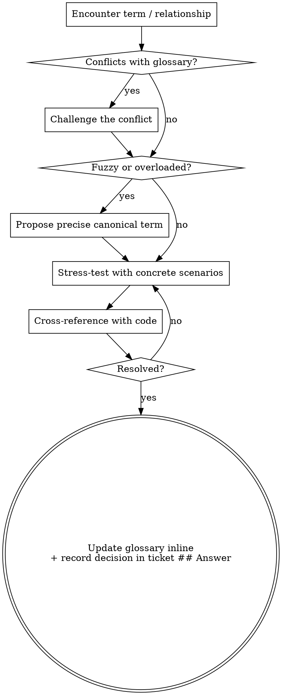

# Domain Modeling

Actively build and sharpen the project's domain model as you design. This is the *active* discipline — challenging terms, inventing edge-case scenarios, and writing the glossary and decisions down the moment they crystallise. Before writing or updating the glossary, first read the canonical `.hamilton/specs/glossary.md` for the project's committed language, then read the current map's working `glossary.md` for the effort's in-progress terms. Reading both is fundamental — you cannot sharpen a model you haven't read. This skill is for when you're changing the model, not just consuming it.

## File structure

Most repos working a single map:

```
.hamilton/
├── specs/
│   └── glossary.md
└── maps/
    └── <effort>/
        ├── map.md
        ├── glossary.md
        └── tickets/
            ├── 01-event-sourced-orders.md
            └── 02-postgres-for-write-model.md
```

When several efforts are worked against a single canonical glossary:

```
.hamilton/
├── specs/
│   └── glossary.md                    ← canonical language
└── maps/
    ├── ordering/
    │   ├── glossary.md                ← working language
    │   └── tickets/                   ← decisions
    └── billing/
        ├── glossary.md
        └── tickets/
```

Create files lazily — only when you have something to write. The canonical `.hamilton/specs/glossary.md` is the source of truth; each map's working `glossary.md` holds that effort's working language. A decision is written into the resolving ticket's `## Answer` — there is no separate directory to create.

## During the session

### Challenge against the glossary

When the user uses a term that conflicts with the existing language in the canonical `.hamilton/specs/glossary.md` or the map's working `glossary.md`, call it out immediately. "Your glossary defines 'cancellation' as X, but you seem to mean Y — which is it?"

### Sharpen fuzzy language

When the user uses vague or overloaded terms, propose a precise canonical term. "You're saying 'account' — do you mean the Customer or the User? Those are different things."

### Discuss concrete scenarios

When domain relationships are being discussed, stress-test them with specific scenarios. Invent scenarios that probe edge cases and force the user to be precise about the boundaries between concepts.

### Cross-reference with code

When the user states how something works, check whether the code agrees. If you find a contradiction, surface it: "Your code cancels entire Orders, but you just said partial cancellation is possible — which is right?"

### Update the glossary inline

When a term is resolved, update the map's `glossary.md` right there. Don't batch these up — capture them as they happen. Use the format in [GLOSSARY-FORMAT.md](references/GLOSSARY-FORMAT.md).

The glossary should be totally devoid of implementation details. Do not treat the glossary as a spec, a scratch pad, or a repository for implementation decisions. It is a glossary and nothing else.

### Record decisions

Every decision is captured in the resolving ticket's `## Answer`. Record the full *why* — context, alternatives considered, and the reason for the choice — when **any** of these holds:

1. **Hard to reverse** — the cost of changing your mind later is meaningful
2. **Surprising without context** — a future reader will wonder "why did they do it this way?"
3. **The result of a real trade-off** — there were genuine alternatives and you picked one for specific reasons

Even when none holds, record at least one line of alternatives — "chose X over Y because Z". A verdict alone is reserved for decisions with no real alternative.

## Process flow


