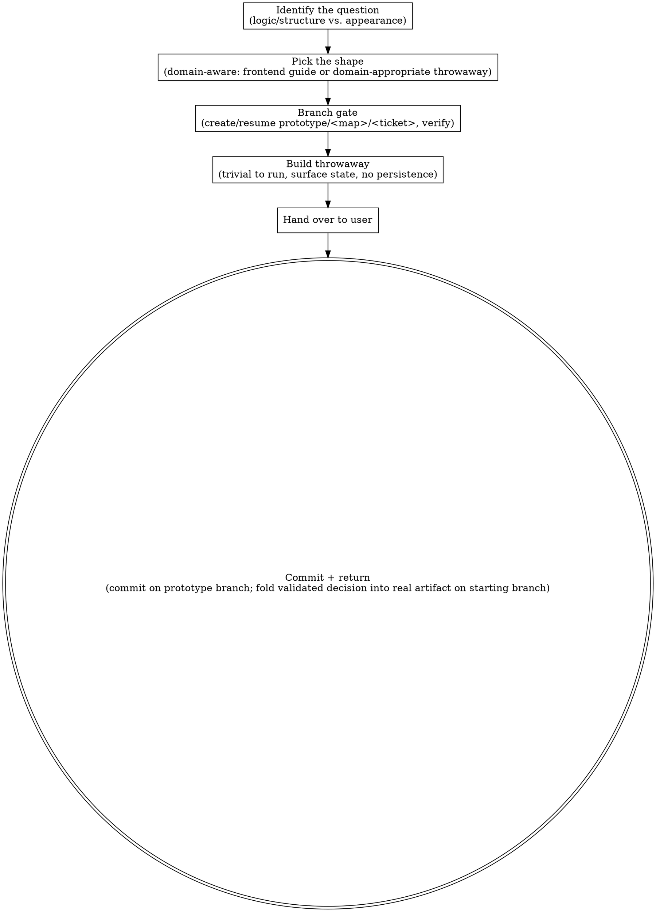

# Prototype

A prototype is **a throwaway artifact that answers one design question** — in software, disposable code; elsewhere, a strawman draft, a mock deck section, a one-page scenario sketch. The question decides the shape.

## Pick the shape

First identify the *question* — from the user's prompt, the surrounding code, or by asking if the user is around. Two broad flavours:

- **"Does this logic / state model feel right?"** — the question has a logic or state-model feel. You want to push real cases through a model and see where it breaks.
- **"What should this look like?"** — the question is about appearance, layout, or structure. You want to generate alternatives and compare them side by side.

Outside software the same two flavours apply — "does this argument structure hold?" vs. "which of these three outlines lands?".

Then pick a throwaway shape appropriate to the project's *domain and stack* — the shape that lets someone push the real cases and see the state change with the least ceremony:

- **Frontend projects** — two detailed guides:
  - [FRONTEND_LOGIC.md](references/FRONTEND_LOGIC.md) — a single shareable HTML file driving a state model: free-play buttons plus tabbed guided walkthroughs, pushable by a non-developer.
  - [FRONTEND_UI.md](references/FRONTEND_UI.md) — several radically different UI variations on a single route, switchable via a URL search param and a floating bottom bar.
- **Other domains** (backend, data, CLI, etc.) — pick the equivalent throwaway shape: a script, a notebook, a CLI harness, whatever lets someone push the real cases and see the state change. The same two flavours apply — a logic probe vs. a structural comparison — but the artifact is whatever the stack makes trivial to run and throw away.

The two flavours produce very different artifacts — getting this wrong wastes the whole prototype. If the question is genuinely ambiguous and the user isn't reachable, default to the shape that best matches the surrounding code (a backend module → a logic/script shape; a page or component → a UI shape) and state the assumption at the top of the prototype.

## Branch gate

Before any prototype artifact is written, create or resume the prototype branch from the current branch. **No prototype code exists before this gate has run.**

- Resolving a map ticket: `~/.hamilton/scripts/hamilton-prototype-branch.sh <map-name> <ticket-name>`, where `<map-name>` is the effort's slug and `<ticket-name>` is the ticket file's `NN-slug`. This creates (or resumes) `prototype/<map-name>/<ticket-name>` and switches to it.
- Invoked standalone, with no map ticket in play: `~/.hamilton/scripts/hamilton-prototype-branch.sh --standalone <question-slug>`, creating or resuming `prototype/<question-slug>`.

Either call's last line is the branch name; confirm the switch took effect with `~/.hamilton/scripts/hamilton-prototype-branch.sh --verify <that branch>` before writing anything. If the script reports `mode: resumed`, an earlier session already started this prototype — pick up where it left off rather than starting over.

If the script is not installed (`hamilton setup` has not run), do the same by hand — the pattern hamilton-propose already uses for isolate: `git switch -c prototype/<map-name>/<ticket-name>` (or `git switch prototype/<map-name>/<ticket-name>` if the branch already exists), same naming, same order.

## Rules that apply to every prototype

1. **Throwaway from day one, and clearly marked as such.** Locate the prototype code close to where it will actually be used (next to the module, page, or pipeline it's prototyping for) so context is obvious — but name it so a casual reader can see it's a prototype, not production. Follow whatever conventions the project already uses for throwaway artifacts; don't invent a new top-level structure.
2. **Trivial to run.** One command in the project's task runner — `pnpm <name>`, `python <path>`, `bun <path>`, etc. — or a single file the user double-clicks. No thinking required to start it.
3. **No persistence by default.** State lives in memory. Persistence is the thing the prototype is _checking_, not something it should depend on. If the question explicitly involves a database, hit a scratch DB or a local file with a clear "PROTOTYPE — wipe me" name.
4. **Skip the polish.** No tests, no error handling beyond what makes the prototype _runnable_, no abstractions. The point is to learn something fast.
5. **Surface the state.** After every action or variant switch, print or render the full relevant state so the user can see what changed.
6. **Capture it when done.** The branch gate already put the prototype on its own branch, so closing is commit-and-return, not move-off: commit any outstanding prototype work on the `prototype/...` branch, then switch back to the branch the session started from. Fold any validated decision into the real artifact there — the branch you returned to, not the prototype branch. Leave a context pointer to the `prototype/...` branch in the resolving ticket's body, and capture the answer too — the verdict and the question it settled — in that ticket's `## Answer`. The prototype branch stays reachable, holding only the throwaway; the working branch it was gated off never carried prototype code at all.

## Process flow

