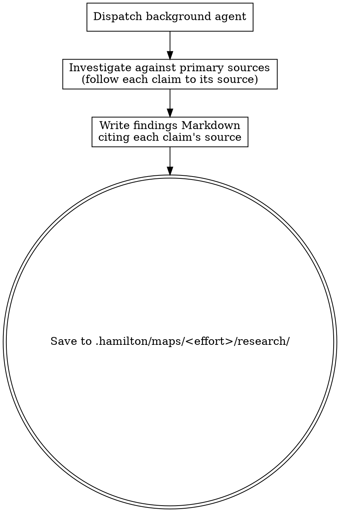

Spin up a **background agent** to do the research, so you keep working while it reads.

Its job:

1. Investigate the question against **primary sources** — official docs, source code, specs, first-party APIs — not a secondary write-up of them. Follow every claim back to the source that owns it.
2. Write the findings to a single Markdown file, citing each claim's source.
3. Save it to `.hamilton/maps/<effort>/research/`, where `<effort>` is the map being worked.

## Process flow

