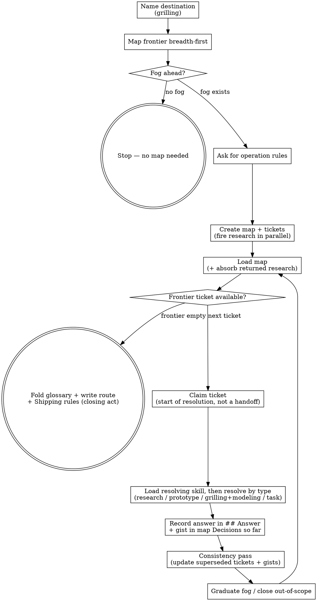

## Opening

Some goals are too big for one agent session — not because the work is hard, but because the way to the end is not yet clear. Wayfinding finds that way before the work begins: chart a **map** of the decisions standing between here and the **destination**, then work them one **ticket** at a time until the **frontier** is empty and the **fog of war** ahead has lifted. The map plans the way; the doing comes later, one change at a time.

## The map

The map is an **index**, not a store — it carries just enough to orient every session and points at the tickets that hold the detail. Six sections fix its shape: **Destination** (what reaching the end looks like), **Notes** (domain and standing preferences), **Operation rules** (per-session-binding instructions on how working sessions operate), **Decisions so far** (one line per resolved ticket, each linking back), **Not yet specified** (the fog), and **Out of scope** (work ruled beyond the destination). Notes holds standing context — the domain in one line and durable preferences; terminology belongs in the glossary, decisions in tickets. Operation rules holds prescriptive rules instead — e.g. commit after resolving a ticket, delegate a class of jobs to a named subagent — and may be left empty. The installed template provides the format; the skill fixes when to create it.

## Ticket types

Every ticket has a type that promises how it gets answered, and each type delegates to a skill:

- **research** (AFK) — a background investigation. Delegate to `hamilton-wayfinder-research`, which reads primary sources and writes cited findings under the map.
- **prototype** (HITL) — a throwaway artifact that answers one design question. Delegate to `hamilton-wayfinder-prototype`.
- **grilling** (HITL) — one-question-at-a-time dialogue that sharpens the decision and the effort's vocabulary. Run `hamilton-grilling`, with `hamilton-wayfinder-domain-modeling` sharpening terms as the dialogue moves.
- **task** (HITL or AFK) — manual work that unblocks a decision. Legitimate only when a named decision cannot be made until the work is done; work that could wait until shipping is not a ticket — record the decision (ticket Answer + map gist) and apply it during shipping via the route. Drive it directly where you can, or hand the human a precise checklist.

A planning ticket resolves only through live exchange with a human. The agent puts each decision to the human and waits — it never stands in for the human's side of the dialogue. Hamilton's three-tier attendance model (Always / Ask first / Never) governs SDD execution downstream, not this planning stage.

## Skill dispatch

A skill MUST be loaded — its SKILL.md read, or invoked via the Skill tool — before any work in its spirit begins; never act in a skill's spirit without loading it first.

| Situation | Load | Write back before closing |
| --- | --- | --- |
| Charting: name the destination, map the frontier | `hamilton-grilling` + `hamilton-wayfinder-domain-modeling`, both before the first question | Destination and Notes in the map; working glossary terms |
| Grilling ticket | `hamilton-grilling` + `hamilton-wayfinder-domain-modeling`, both before the first question | Ticket `## Answer`; glossary updates; map gist |
| Prototype ticket | `hamilton-wayfinder-prototype` | Ticket `## Answer` + pointer to the prototype branch; map gist |
| Research ticket | `hamilton-wayfinder-research` (background agent) | Findings file + ticket pointer; on return, ticket `## Answer` + map gist (work loop step 1) |
| Task ticket | none — drive directly, or hand the human a checklist | Ticket `## Answer`; map gist |

Every grilling invocation supplies content and an exit condition (see grilling's Invocation contract).

## Fog of war

Not every decision can be stated sharply at the start. The fog of war is the dim view ahead — decisions you can tell are coming but cannot yet pin down, because they hang on questions still open. It lives in the map's Not yet specified, deliberately uncharted. The test separating fog from a ticket is whether the question can be stated precisely now, not whether it can be answered now. When a resolution makes a foggy question specifiable, the fog graduates: it clears from Not yet specified and becomes a new ticket.

## Out of scope

Some work is consciously ruled beyond the destination. It goes in Out of scope and stays there — it never graduates into a ticket, because a ticket exists to advance toward the destination and out-of-scope work does not. Listing it keeps later sessions from re-litigating the boundary.

## Chart the map

Charting is one session's work and resolves no tickets — it names the destination and lays out the frontier.

1. **Name the destination.** Run a `hamilton-grilling` session to fix what reaching the end of the map looks like — the spec, decision, or change the effort is finding its way to.
2. **Map the frontier breadth-first.** Grill across the whole space, surfacing open decisions and first takeable steps.
3. **Check for fog.** If breadth-first grilling surfaces no fog, the way is already clear for one session — stop and tell the user a map is not needed.
4. **Ask for operation rules.** Ask the user for standing per-effort instructions on how working sessions operate — e.g. commit after resolving a ticket, delegate a class of jobs to a named subagent. The user may decline; the map's Operation rules section is then left empty.
5. **Create the map.** Write it from the installed template at `~/.hamilton/templates/wayfinder/map.md`, with `branch:` set to the branch the charting session is on — the branch the effort works from and merges back into (on a detached HEAD, record the repository's default branch and tell the user) — Destination and Notes filled in, Operation rules holding whatever the user gave in the previous step, Decisions so far empty, and the fog sketched into Not yet specified.
6. **Create the tickets that can be specified now.** Write each from the installed template at `~/.hamilton/templates/wayfinder/ticket.md`, then wire each ticket's blocking dependencies in a second pass once the set exists.
7. **Fire research in parallel.** For any research tickets, dispatch `hamilton-wayfinder-research` subagents so the reading happens in the background while charting continues.

## Work through the map

Working is the loop that clears the map one ticket at a time.

1. **Load the map.** Read its low-resolution view to orient: the destination, the decisions already made, and the fog still ahead. Read the frontmatter's `branch:` and the Operation rules section too, and apply each rule to the actions it covers as the session proceeds — a commit-after-resolution rule produces a commit when a ticket resolves; a subagent-delegation rule routes the named job to the named subagent rather than doing it inline. Then check for returned research: for each completed investigation, distill the findings into its ticket's `## Answer`, link the findings file from the ticket body, mark the ticket resolved, and gist it to the map. This work is exempt from the one-ticket-per-session budget.
2. **Choose the frontier ticket.** Take the first ticket on the frontier (defined in Map mechanics).
3. **Claim it.** Mark the ticket in hand before any work begins, so a reader knows it is being worked. Claiming is the start of resolution, not a handoff: the claiming session immediately takes the ticket as far as its type allows — a HITL ticket resolves in this session; a research ticket is dispatched now and resolves when its findings return.
4. **Resolve it.** The skill the ticket's type promises (see Skill dispatch) MUST be loaded before any resolution work, where the type names one — resolving a typed ticket without loading its skill is a contract violation. For a prototype ticket specifically, no prototype code exists before `hamilton-wayfinder-prototype` is loaded and its branch gate has run.
5. **Record the answer.** Append the resolution under a `## Answer` heading in the ticket, mark the ticket resolved, and append a one-line gist to the map's Decisions so far with a link back to the ticket.
6. **Consistency pass.** Scan the map's Decisions so far for gists the new resolution contradicts. For each, open that ticket, move its old Answer to `## Outdated decisions` with a link to the superseding ticket, write the current truth into `## Answer`, and rewrite its gist line in the map. If the route exists, update the affected unit's decision line as well.
7. **Graduate or close.** If the resolution makes new tickets specifiable, create them and clear the graduated fog from Not yet specified. If it reveals a ticket sits beyond the destination, close the ticket and leave one line in Out of scope.

Resolve at most one ticket per session — with the exception of research tickets, which run in the background and do not consume the session's focus. This is a ceiling, not a deferral: never park a claimed ticket — take it as far as its type allows before the session ends.

## The route

When the last ticket resolves, the map clears and the route is written — once, as a closing act. The route is a static handoff: it lists the change-sized units in order. Each unit carries its goal paragraph plus one line per backing decision stating its outcome — e.g. "Decided: Postgres for the write model (ticket 02)". Reasoning, context, and alternatives stay in the ticket; the route line is the drill-down entry point, so an implementer knows every decision constraining a unit from the route alone and opens tickets only for the why. Before writing the route, fold the working glossary's resolved terms into the canonical `.hamilton/specs/glossary.md`, favoring the newer term and confirming with the user any change to committed language. Then write the route from the installed template at `~/.hamilton/templates/wayfinder/route.md`, filling its `## Shipping rules` section from the map's `branch:` field — the merge-back target — plus any Operation rules that concern shipping, so the route stays self-contained for downstream processes that never open the map.

The map then moves through its lifecycle: open while charting and working, cleared when every ticket is resolved and the route is written, shipping while the route's units are executed, and shipped when the last unit lands. Each unit is executed by whatever downstream process the effort uses. The process that starts a unit flips it `pending → in-progress` on its own branch; the process that completes it flips it `in-progress → shipped`, so the flip ships with the work it marks. The process starting the first unit flips the map `cleared → shipping`; the process shipping the last unit flips the map `shipping → shipped`.

## Map mechanics

This section is the contract between the wayfinder methodology and its file-native implementation — the only place mechanics are defined. The rest of the skill refers to concepts; a future backend swaps this section and verifies in one pass that nothing above it defines a field, a path, or a branching rule.

**Frontmatter.** Every ticket and the map carry YAML frontmatter. Tickets use `type:` (`research` / `prototype` / `grilling` / `task`), `status:` (`open` / `claimed` / `resolved`), and `blocked_by:` (a list of ticket numbers). The map uses `status:` (`open` / `cleared` / `shipping` / `shipped`) and `branch:` (the branch the effort works from and merges back into, set at map creation; a map created before this field falls back to the repository's default branch).

**Route units.** Each unit in `route.md` carries a `Status:` line with values `pending` / `in-progress` / `shipped`. The executing process flips it (see The route).

**Frontier.** The frontier is the set of tickets with `status: open` — excluding `claimed` and `resolved` — whose every `blocked_by` entry is resolved, taken in file order. "Open" always names the status value; use "unresolved" for any ticket not yet resolved.

**File layout.** A map lives at `.hamilton/maps/<effort>/` — an undated slug that is the effort's identity — holding `map.md`, `route.md` once the map clears, and `tickets/NN-slug.md` numbered from `01`.

**Claiming.** Setting a ticket's `status:` to `claimed` signals intent: it tells a reader the ticket is in hand and removes the ticket from the frontier. It does not prevent a collision — concurrent sessions collide through git; the claim is how a reader sees the ticket is already being worked.

**Branching.** Map artifacts are ordinary repo content, versioned and branched like source. A status flip rides the unit's own branch and lands on the default branch at merge, so the flip ships with the work it marks. Between merges the route lags on the default branch; that staleness is accepted, not a defect.

## Process flow

