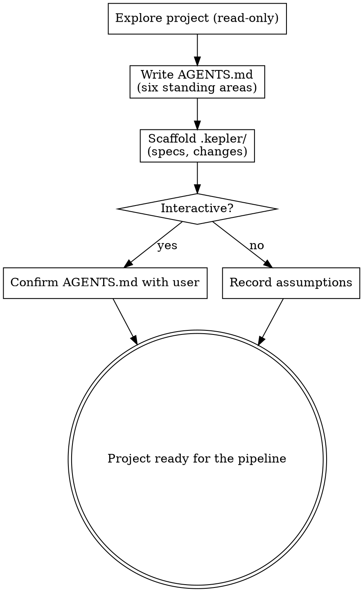

# Initializing a project

Prepare an existing project for the pipeline: capture how the project works in `AGENTS.md`
and create the `.kepler/` workspace the other steps rely on. Run this once, up front.

The **seven-stage core pipeline** is Kepler's fixed spec-driven sequence: init → propose → plan → code →
code-feedback → review → finish-work. Each step is a skill a person or an agent can run. This
skill is **step 0** — it runs before any change, and produces the standing project standards
every later step reads. Wayfinder and `kepler-critique` are optional and remain outside the
seven-step core count.

## What it produces

- `AGENTS.md` at the project root — the project's standing standards.
- `.kepler/` workspace: `specs/` and `changes/`.

It does not create templates: the artifact templates are global, installed at
`${XDG_CONFIG_HOME:-$HOME/.config}/.vialactea-works/kepler/templates/` by the `kepler setup` command, and shared across projects.

## Inputs

- An existing project (a git repository).
- Anything the user wants emphasized in the standards (optional).

## Process

1. **Explore (read-only).** Learn the project: languages and versions, how it builds and
   tests, its directory layout, its conventions, and any CI. Read package manifests, config,
   and a sample of the code — do not guess. Make no edits in this step.
2. **Write `AGENTS.md`.** Cover the six standing areas below. Create the file if missing; if
   it exists, extend it rather than overwrite the user's content.
   - **Commands** — the exact build / test / lint commands, with flags.
   - **Testing** — the framework, where tests live, how to run them, coverage expectations.
   - **Project structure** — where source, tests, and docs live.
   - **Code style** — naming and formatting rules, plus one short real example from the code.
   - **Git workflow** — branch naming, commit format, pull-request conventions, and the
     default finish strategy (`local-merge` or `pull-request`) `kepler-finish-work` reads.
   - **Boundaries** — three tiers: Always / Ask first / Never (e.g. "Never commit secrets").
3. **Check for legacy project data before scaffolding.** If `.hamilton/` exists and `.kepler/` does not, run `kepler workbench context --all` from the project root before creating `.kepler/`; this copies existing data to the canonical path and leaves the legacy source intact. A `no .kepler/changes/` result with exit code `1` means there are no changes to list; confirm `.kepler/` exists and continue. Stop on any other migration error. When both directories exist, Kepler uses `.kepler/` without merging or modifying `.hamilton/`.
4. **Scaffold `.kepler/`.** Create missing directories only; preserve any data copied from `.hamilton/`.
   - `specs/` — canonical capability truth.
   - `changes/` — one directory per change.
5. **Confirm or record.** Working with a person, show the drafted `AGENTS.md` for correction
   before finishing — these standards steer every later step, so accuracy matters. Running
   unattended, record any assumptions you made.

## Principles

- **Read, don't guess.** `AGENTS.md` must reflect the real project. Wrong standards mislead
  every downstream step.
- **Don't clobber.** If `AGENTS.md` already exists, extend it and preserve what's there.
- **Idempotent.** Re-running updates `AGENTS.md` and fills any missing `.kepler/` pieces
  without touching existing specs or changes.

## Output

`AGENTS.md` written or updated, and `.kepler/{specs,changes}/` in place. The project is
ready for `kepler-propose` (or `kepler-plan` for tactical changes).

## Process flow

